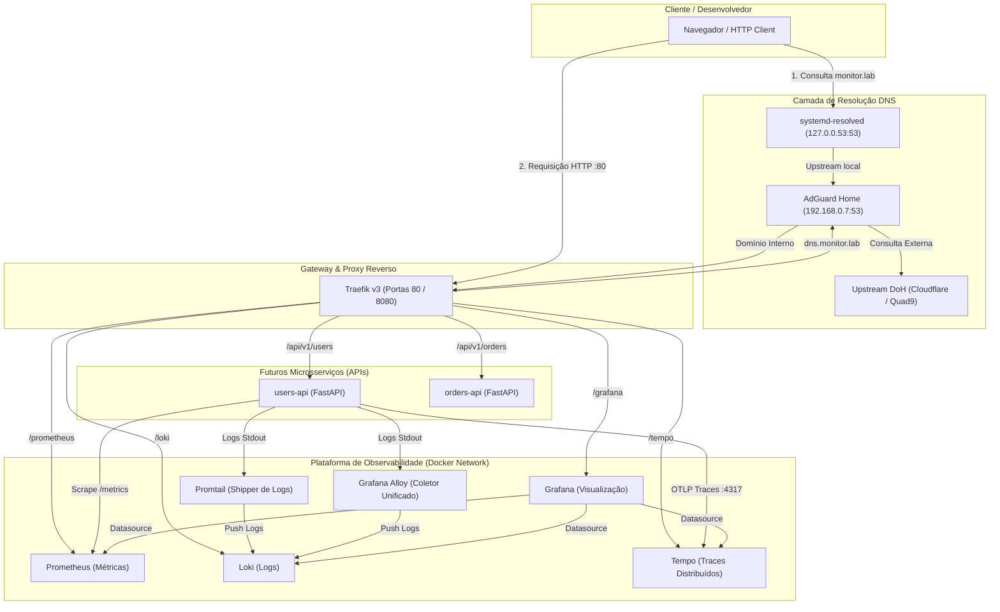
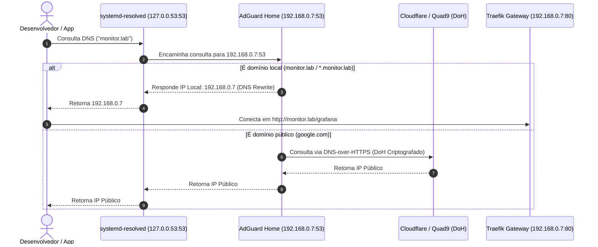
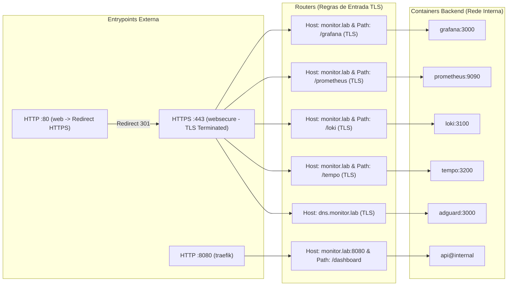
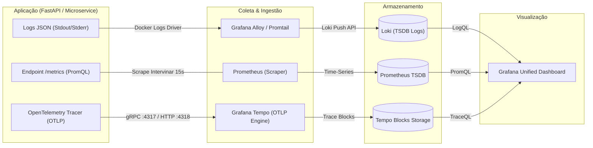
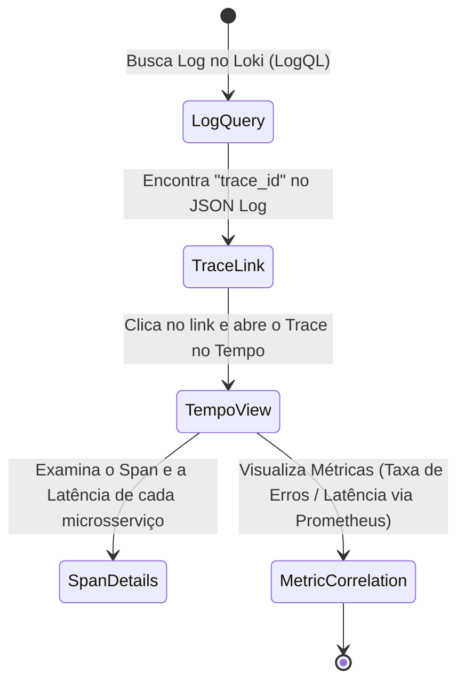
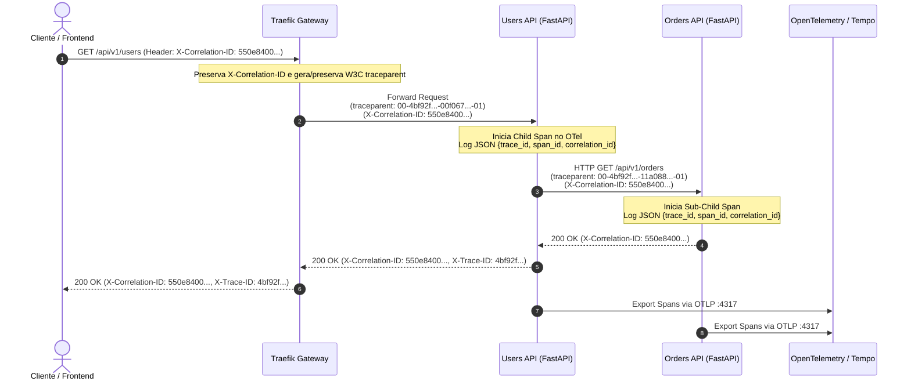

# Arquitetura e Diagramas da Infraestrutura

> **Documento:** Guia Visual da Infraestrutura  
> **Objetivo:** Explicar a arquitetura completa do **Observability Lab** utilizando diagramas em Mermaid e fluxogramas detalhados.

---

## 1. Visão Geral da Arquitetura da Infraestrutura

Este diagrama ilustra todos os componentes da plataforma de observabilidade, suas redes, portas expostas e como eles se relacionam.



---

## 2. Fluxo da Camada de DNS e Coexistência

Diagrama detalhado mostrando como o `systemd-resolved` e o `AdGuard Home` coexistem sem conflito na porta 53:



---

## 3. Fluxo de Roteamento do Proxy Reverso (Traefik v3)

Como o **Traefik** recebe as requisições na porta `80` (redirecionando para HTTPS `443` com terminação TLS) e encaminha internamente na rede Docker `observability-net`:



---

## 4. Pipeline dos 3 Pilares da Observabilidade

Como os **Logs**, **Métricas** e **Traces** fluem das aplicações até o Grafana:



---

## 5. Correlação Cruzada no Grafana (Cross-Telemetry Correlation)

Como as três pilares da observabilidade se conectam dentro da interface do Grafana:



---

## 6. Propagação de Contexto (W3C Trace Context & Correlation ID)

Como uma requisição distribuída mantém o rastreamento entre múltiplos microsserviços:



---

## 7. Mapeamento de Portas e Serviços

```text
┌─────────────────────────────────────────────────────────────────────────┐
│                              PORTAS HOST                                │
├───────────┬───────────────────────────────┬─────────────────────────────┤
│ Porta     │ Serviço                       │ Acesso                      │
├───────────┼───────────────────────────────┼─────────────────────────────┤
│ :53       │ AdGuard Home (DNS TCP/UDP)    │ 192.168.0.7:53 (Rede LAN)   │
│ :80       │ Traefik Gateway               │ http://monitor.lab/         │
│ :3053     │ AdGuard Home Setup Direct     │ http://localhost:3053/      │
│ :8080     │ Traefik API & Dashboard       │ http://monitor.lab:8080/    │
└───────────┴───────────────────────────────┴─────────────────────────────┘

┌─────────────────────────────────────────────────────────────────────────┐
│                         REDES INTERNAS DOCKER                           │
├───────────┬───────────────────────────────┬─────────────────────────────┤
│ Container │ Rede                          │ Porta Interna               │
├───────────┼───────────────────────────────┼─────────────────────────────┤
│ traefik   │ observability-net             │ 80 / 8080                   │
│ grafana   │ observability-net             │ 3000                        │
│ prometheus│ observability-net             │ 9090                        │
│ loki      │ observability-net             │ 3100                        │
│ tempo     │ observability-net             │ 3200 / 4317 (gRPC) / 4318   │
│ alloy     │ observability-net             │ 12345                       │
│ promtail  │ observability-net             │ 9080                        │
│ adguard   │ observability-net             │ 3000 (web) / 53 (dns)       │
└───────────┴───────────────────────────────┴─────────────────────────────┘
```
