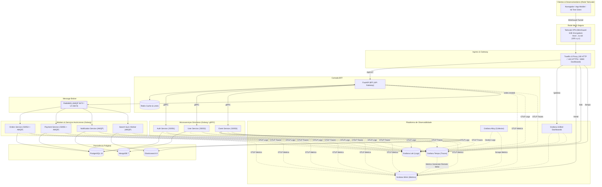
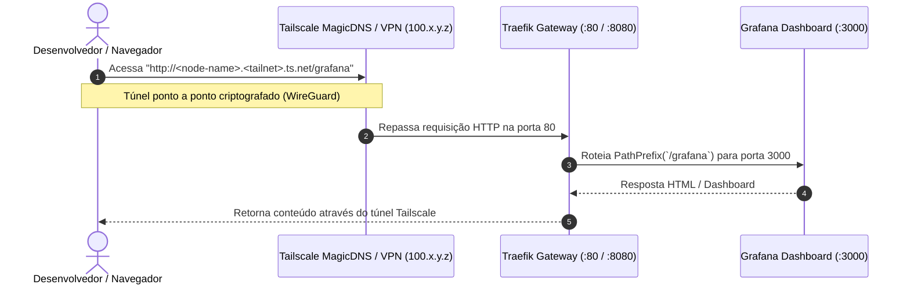

# Arquitetura e Diagramas da Infraestrutura — Ticket Booking Lab

> **Documento:** Guia Visual da Infraestrutura e Ecossistema  
> **Objetivo:** Mapear todos os fluxos de rede, DNS, telemetria, roteamento e mensageria utilizando diagramas Mermaid.

---

## 1. Visão Geral da Topologia de Rede e Infraestrutura



---

## 2. Fluxo de Acesso Remoto e Criptografia via Tailscale



---

## 3. Roteamento do Traefik v3 (PathPrefix & Middlewares)

```mermaid
graph LR
    subgraph Entrada["Entrypoints"]
        E80["HTTP :80 (web)"]
        E443["HTTPS :443 (websecure)"]
        E8080["HTTP :8080 (traefik dashboard)"]
    end

    subgraph Routers["Routers PathPrefix"]
        R_API["PathPrefix: /api/v1"]
        R_Grafana["PathPrefix: /grafana"]
        R_Mimir["PathPrefix: /mimir"]
        R_Loki["PathPrefix: /loki"]
        R_Tempo["PathPrefix: /tempo"]
        R_Dash["PathPrefix: /dashboard"]
    end

    subgraph Services["Backends na Rede observability-net"]
        C_BFF["fastapi-bff:8000"]
        C_Grafana["grafana:3000"]
        C_Mimir["mimir:8080"]
        C_Loki["loki:3100"]
        C_Tempo["tempo:3200"]
        C_Traefik["traefik:internal"]
    end

    E80 --> R_API --> C_BFF
    E80 --> R_Grafana --> C_Grafana
    E80 --> R_Mimir --> C_Mimir
    E80 --> R_Loki --> C_Loki
    E80 --> R_Tempo --> C_Tempo
    E443 -.-> R_Grafana
    E8080 --> R_Dash --> C_Traefik

---

## 4. Pipeline dos 3 Pilares da Observabilidade com OpenTelemetry

```mermaid
flowchart LR
    subgraph Services["Aplicações (Python BFF & Go Microservices)"]
        OTelLog["OTel Logger (JSON Stdout/OTLP)"]
        OTelMeter["OTel Meter (RED Metrics)"]
        OTelTracer["OTel Tracer (W3C Spans)"]
    end

    subgraph Ingestion["Camada de Ingestão e Armazenamento"]
        Alloy["Grafana Alloy (Container Logs & Scraping)"]
        MimirDB[("Grafana Mimir TSDB")]
        LokiDB[("Grafana Loki")]
        TempoDB[("Grafana Tempo")]
    end

    subgraph UI["Visualização"]
        Grafana["Grafana Unified Dashboard"]
    end

    OTelLog -->|Direct OTLP| LokiDB
    OTelLog -->|Docker Socket| Alloy -->|Push API| LokiDB
    OTelMeter -->|OTLP HTTP / Push| MimirDB
    OTelTracer -->|OTLP gRPC :4317| TempoDB
    TempoDB -->|Remote Write| MimirDB

    MimirDB -->|PromQL| Grafana
    LokiDB -->|LogQL| Grafana
    TempoDB -->|TraceQL| Grafana
```
