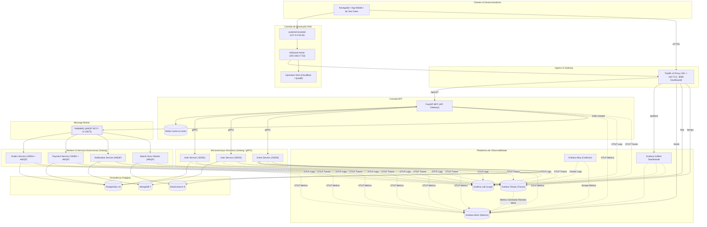
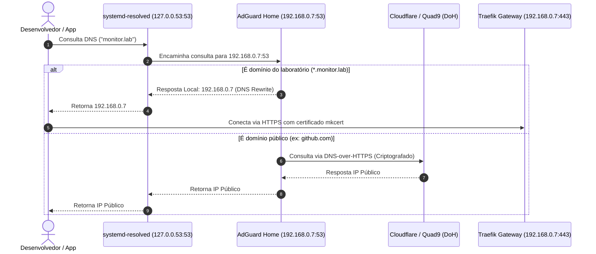
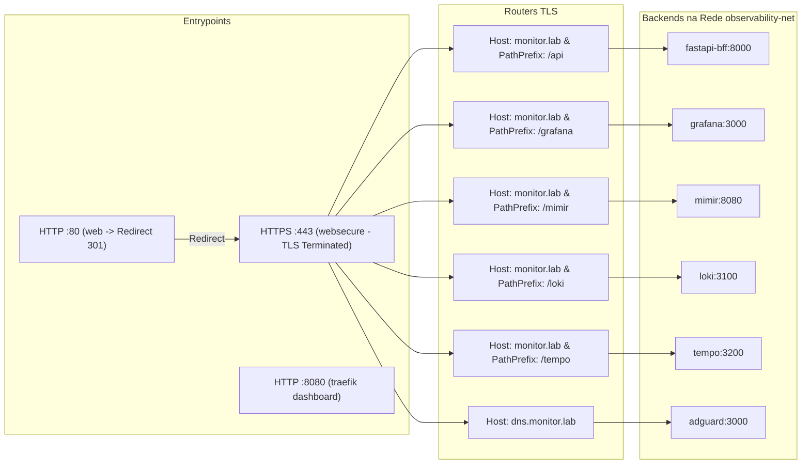
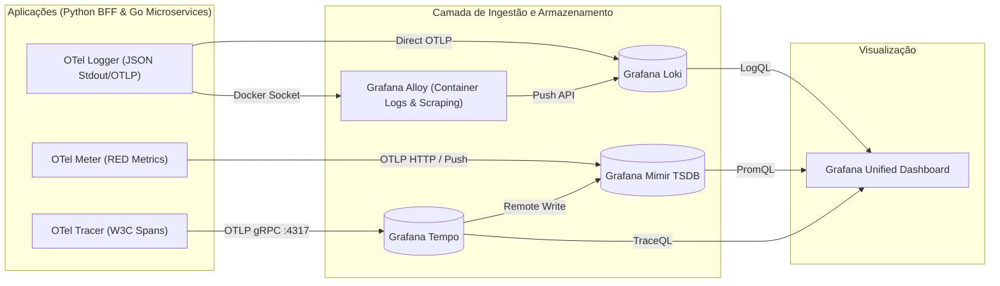

# Arquitetura e Diagramas da Infraestrutura — Ticket Booking Lab

> **Documento:** Guia Visual da Infraestrutura e Ecossistema  
> **Objetivo:** Mapear todos os fluxos de rede, DNS, telemetria, roteamento e mensageria utilizando diagramas Mermaid.

---

## 1. Visão Geral da Topologia de Rede e Infraestrutura

---

## 2. Fluxo da Camada de DNS (Coexistência na Porta 53)

---

## 3. Roteamento do Traefik v3 (TLS & Middlewares)

---

## 4. Pipeline dos 3 Pilares da Observabilidade com OpenTelemetry

