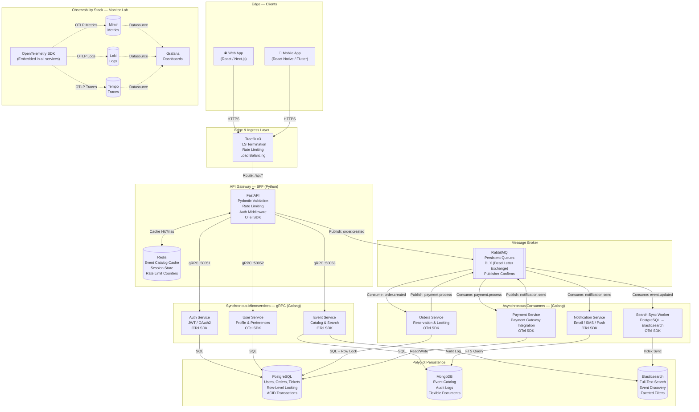
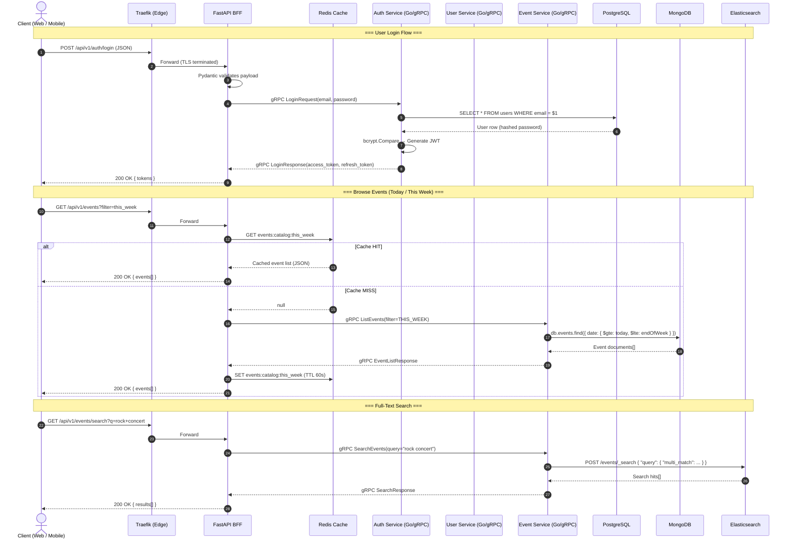
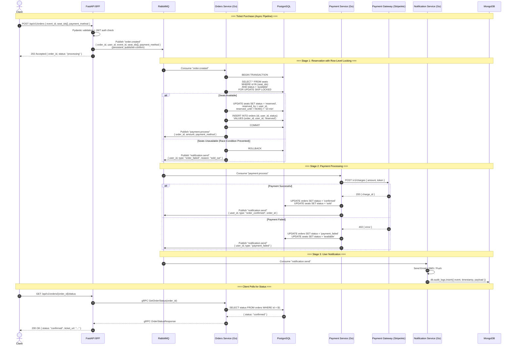
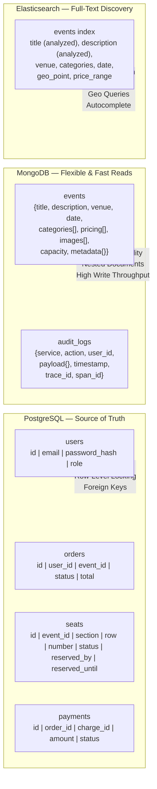
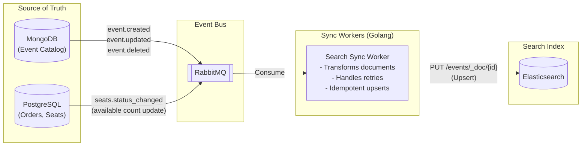
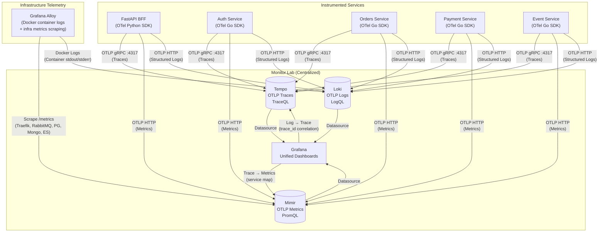

# High-Concurrency Ticket Booking System — Architecture

> **Document:** System Architecture Diagram  
> **Role:** Senior Cloud Architect  
> **Goal:** Design a production-grade, high-concurrency ticket booking platform with polyglot persistence, mixed sync/async communication, and full observability.

---

## 1. Full System Architecture



---

## 2. Synchronous Flow — gRPC Reads & Authentication

Low-latency operations that require an immediate response use **gRPC** for binary-serialized, schema-enforced communication between the FastAPI BFF and internal Golang microservices.



---

## 3. Asynchronous Flow — High-Concurrency Ticket Purchase

The ticket purchase is the **hottest path** in the system. To absorb burst traffic without blocking the client, the BFF publishes an event to RabbitMQ and returns `202 Accepted` immediately. Downstream consumers process at their own pace.



---

## 4. Polyglot Persistence Strategy

Each database is chosen for its strengths in a specific domain:



---

## 5. Data Synchronization Pipeline

Keeping Elasticsearch in sync with the source data via RabbitMQ event-driven updates:



---

## 6. Observability Pipeline (Monitor Lab Integration)

Every service is instrumented with the **OpenTelemetry SDK**, exporting telemetry directly via OTLP to the centralized Monitor Lab:



---

## 7. Service Map & Port Allocation

```text
┌──────────────────────────────────────────────────────────────────────────────────┐
│                              EXTERNAL PORTS (HOST)                               │
├──────────┬──────────────────────────────────┬────────────────────────────────────┤
│ Port     │ Service                          │ Protocol / Purpose                 │
├──────────┼──────────────────────────────────┼────────────────────────────────────┤
│ :80      │ Traefik (web)                    │ HTTP → Redirect HTTPS              │
│ :443     │ Traefik (websecure)              │ HTTPS (TLS Termination)            │
│ :8080    │ Traefik Dashboard                │ HTTP (Dev only)                    │
│ :15672   │ RabbitMQ Management UI           │ HTTP (Dev only)                    │
└──────────┴──────────────────────────────────┴────────────────────────────────────┘

┌──────────────────────────────────────────────────────────────────────────────────┐
│                         INTERNAL DOCKER NETWORK                                  │
├──────────────────┬──────────┬───────────────────────────────────────────────────┤
│ Service          │ Port     │ Protocol / Notes                                   │
├──────────────────┼──────────┼───────────────────────────────────────────────────┤
│ fastapi-bff      │ 8000     │ HTTP (Uvicorn)                                     │
│ auth-service     │ 50051    │ gRPC (Protobuf)                                    │
│ user-service     │ 50052    │ gRPC (Protobuf)                                    │
│ event-service    │ 50053    │ gRPC (Protobuf)                                    │
│ orders-service   │ 50054    │ gRPC (Protobuf) + RabbitMQ Consumer                │
│ payment-service  │ 50055    │ gRPC (Protobuf) + RabbitMQ Consumer                │
│ notif-service    │ 50056    │ gRPC (Protobuf) + RabbitMQ Consumer                │
│ rabbitmq         │ 5672     │ AMQP 0.9.1 (Message Broker)                        │
│ redis            │ 6379     │ RESP (Cache / Rate Limit)                           │
│ postgresql       │ 5432     │ PostgreSQL Wire Protocol                            │
│ mongodb          │ 27017    │ MongoDB Wire Protocol                               │
│ elasticsearch    │ 9200     │ HTTP (REST API)                                     │
│ mimir            │ 8080     │ OTLP / Prometheus Remote Write                      │
│ loki             │ 3100     │ OTLP / Loki Push API                                │
│ tempo            │ 3200     │ HTTP API / 4317 gRPC OTLP / 4318 HTTP OTLP          │
│ grafana          │ 3000     │ HTTP (Dashboards)                                   │
│ alloy            │ 12345    │ HTTP (Self-metrics + Config UI)                      │
└──────────────────┴──────────┴───────────────────────────────────────────────────┘
```

---

## 8. Key Architectural Decisions

### Why gRPC for Reads?
- **Binary serialization** (Protobuf) is ~10x faster than JSON for structured payloads.
- **Strict contracts** via `.proto` files enforce API compatibility between Python (BFF) and Go (services).
- **HTTP/2 multiplexing** allows concurrent requests on a single TCP connection.

### Why RabbitMQ for Writes?
- **Persistent queues** guarantee no message loss even if consumers crash.
- **Dead Letter Exchanges (DLX)** capture failed messages for retry and inspection.
- **Publisher confirms** ensure the BFF knows the message was durably stored before returning `202`.
- **Decouples throughput**: The BFF can accept 10,000 orders/sec while consumers process at 1,000/sec without backpressure.

### Why Row-Level Locking (`FOR UPDATE SKIP LOCKED`)?
- Prevents **double-booking** race conditions when 500 users try to reserve the same seat simultaneously.
- `SKIP LOCKED` ensures non-contending rows are processed immediately, avoiding global lock contention.

### Why Redis at the BFF?
- Event catalogs are **read-heavy** and change infrequently — a 60-second TTL cache absorbs 95%+ of read traffic.
- Rate limiting counters with sliding window prevent abuse without adding latency to every request.

### Why Polyglot Persistence?
| Database | Strength | Use Case |
|---|---|---|
| **PostgreSQL** | ACID, row-level locking, referential integrity | Users, orders, seats, payments |
| **MongoDB** | Flexible schema, nested documents, high write throughput | Event catalog, audit logs |
| **Elasticsearch** | Full-text search, faceted filters, geo queries | Event discovery, autocomplete |
