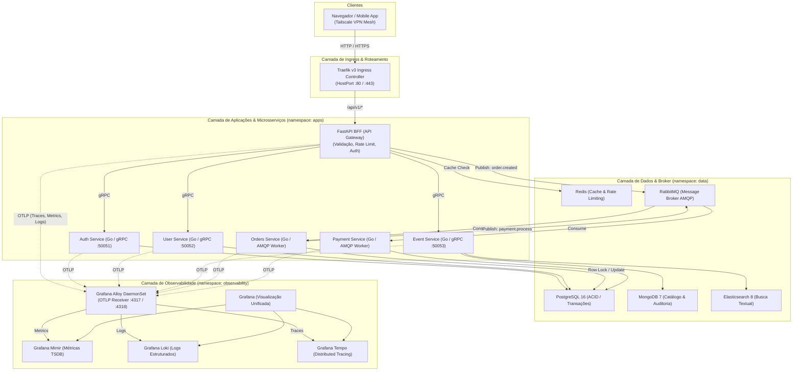

# Fluxo de Dados e Arquitetura do Sistema

Este documento descreve detalhadamente como os dados trafegam pelo ecossistema do **Ticket Booking System** e pela infraestrutura do **Observability Lab** no cluster K3s.

---

## 1. Visão Geral dos Fluxos de Dados



---

## 2. Fluxo 1: Requisição Síncrona (Leitura de Catálogo e Autenticação)

1. **Cliente:** O navegador ou app mobile envia requisição HTTPS para `http://<SEU_TAILSCALE_HOST>/api/v1/events`.
2. **Traefik Ingress:** Valida a origem contra o middleware `tailscale-ipallowlist` e encaminha a requisição internamente para o service `fastapi-bff:8000`.
3. **FastAPI BFF:**
   - Verifica o cache distribuído no **Redis**.
   - Se for um *Cache Hit*, responde imediatamente em poucos milissegundos.
   - Se for um *Cache Miss*, dispara chamada gRPC de baixa latência para o `event-service:50053`.
4. **Event Service:** Consulta o **MongoDB** ou **Elasticsearch**, formata a resposta Protobuf e devolve para o BFF.
5. **FastAPI BFF:** Atualiza o cache no Redis e devolve a resposta JSON ao cliente.

---

## 3. Fluxo 2: Compra de Ingressos de Alta Concorrência (Assíncrono)

```text
[Cliente] ──► Traefik ──► FastAPI BFF ──► Publica 'order.created' ──► Retorna 202 Accepted (Imediato)
                                                │
                                                ▼
                                        [Fila RabbitMQ]
                                                │
                                                ▼
                                      [Orders Service Worker]
                                      • Abre transação PostgreSQL
                                      • SELECT ... FOR UPDATE SKIP LOCKED
                                      • Garante reserva única do assento
                                      • Publica evento 'payment.process'
                                                │
                                                ▼
                                      [Payment Service Worker]
                                      • Processa a transação
                                      • Confirma pedido no banco
```

- **Por que esse fluxo?** Absorve picos massivos de requisições simultâneas sem derrubar o banco de dados. O cliente recebe resposta imediata (`202 Accepted`) e acompanha o status via WebSocket ou polling.

---

## 4. Fluxo 3: Pipeline de Telemetria (OpenTelemetry + LGTM)

Cada requisição gera dados nos **3 pilares da observabilidade**:

1. **W3C Trace Context Propagation:**
   - O Traefik ou BFF inicia o cabeçalho `traceparent: 00-4bf92f3577b34da6a3ce929d0e0e4736-00f067aa0ba902b7-01`.
   - Esse cabeçalho viaja com a requisição através do gRPC (metadados de contexto) e pelas mensagens AMQP do RabbitMQ (headers da mensagem).
2. **Ingestão no Grafana Alloy:**
   - As aplicações enviam spans, métricas e logs estruturados em formato OTLP para o Pod do **Alloy** (`alloy.observability.svc.cluster.local:4317`).
3. **Distribuição para os Backends (LGTM):**
   - **Métricas:** Alloy encaminha para o **Mimir** via Prometheus Remote Write.
   - **Logs:** Alloy adiciona metadados do Kubernetes (`namespace`, `pod`, `container`) e encaminha para o **Loki**.
   - **Traces:** Alloy envia os spans para o **Tempo**.
4. **Visualização no Grafana:**
   - O Grafana correlaciona as 3 fontes: um alerta de latência no Mimir leva diretamente aos traces do Tempo e aos logs correspondentes no Loki pelo `traceID`.

---

## 5. Fluxo 4: Pipeline de CI/CD e GitOps

```text
[Desenvolvedor]
      │ git push origin main
      ▼
[GitHub Actions (CI)]
      ├─ Roda linters e testes unitários
      ├─ Constrói imagem multi-arch Docker
      └─ docker push <DOCKERHUB_USER>/<SERVICO>:latest (Docker Hub)
      │
      ▼
[Flux CD no Cluster K3s (CD)]
      ├─ Lê o repositório GitHub a cada 1 minuto
      ├─ Decripta os segredos SOPS usando a chave privada 'sops-age'
      └─ Aplica os manifests atualizados no K3s de forma autônoma
```

---

## 6. Topologia de Armazenamento e Proteção de I/O

| Armazenamento | Tipo Físico | Ponto de Montagem | Uso Exclusivo |
|---|---|---|---|
| **NVMe SSD** (~120 GB) | SSD de Alta Velocidade | `/` (`/var/lib/rancher/k3s`) | Sistema Operacional, binários do K3s, SQLite/etcd leve e imagens de container. |
| **SATA HDD** (1 TB) | HDD Massivo | `/mnt/dados` (`/mnt/dados/k3s-storage`) | **StorageClass `local-hdd`:** TSDB do Mimir, Chunks do Loki, Blocks do Tempo, Bancos de Dados (PostgreSQL, MongoDB, Elasticsearch). |

> [!NOTE]
> Essa separação garante que escritas e consultas massivas de logs e métricas não degradem o SSD do sistema operacional nem esgotem o espaço da raiz.

