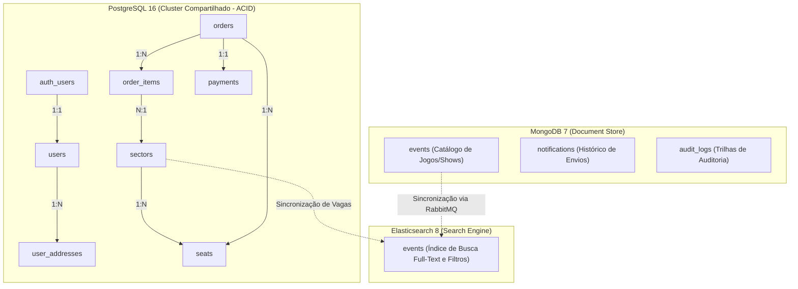
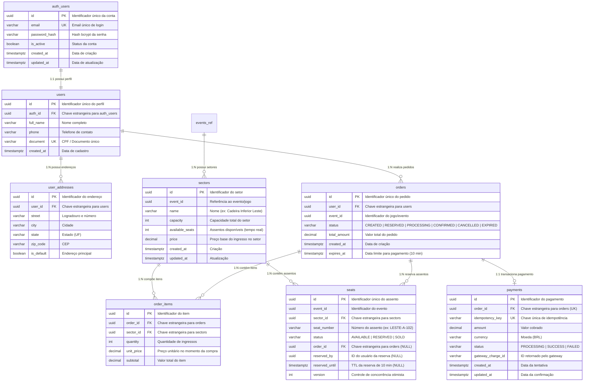
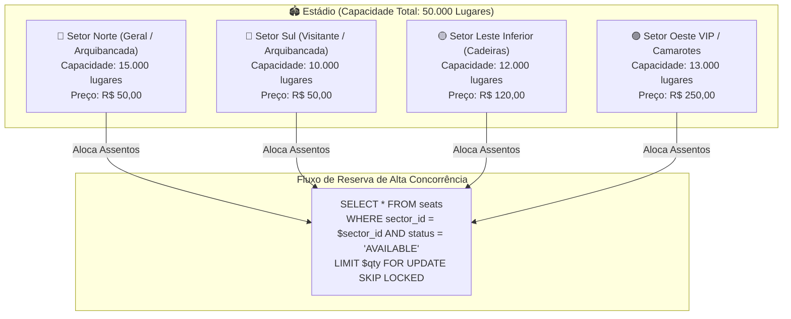
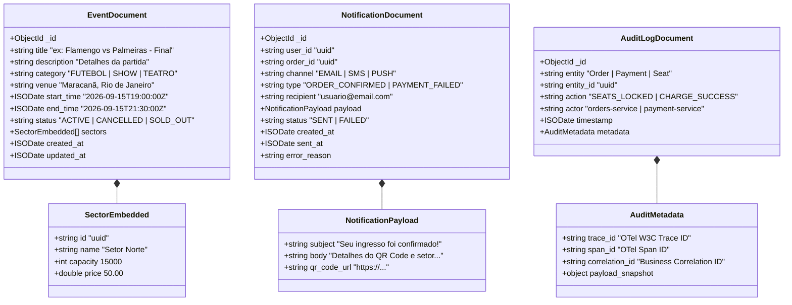
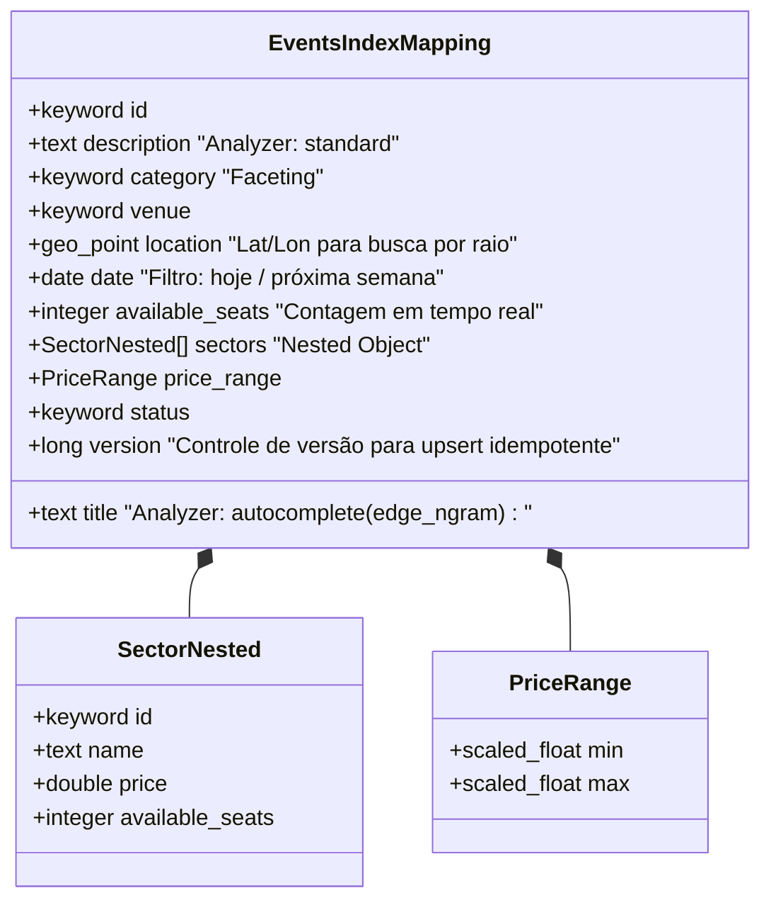
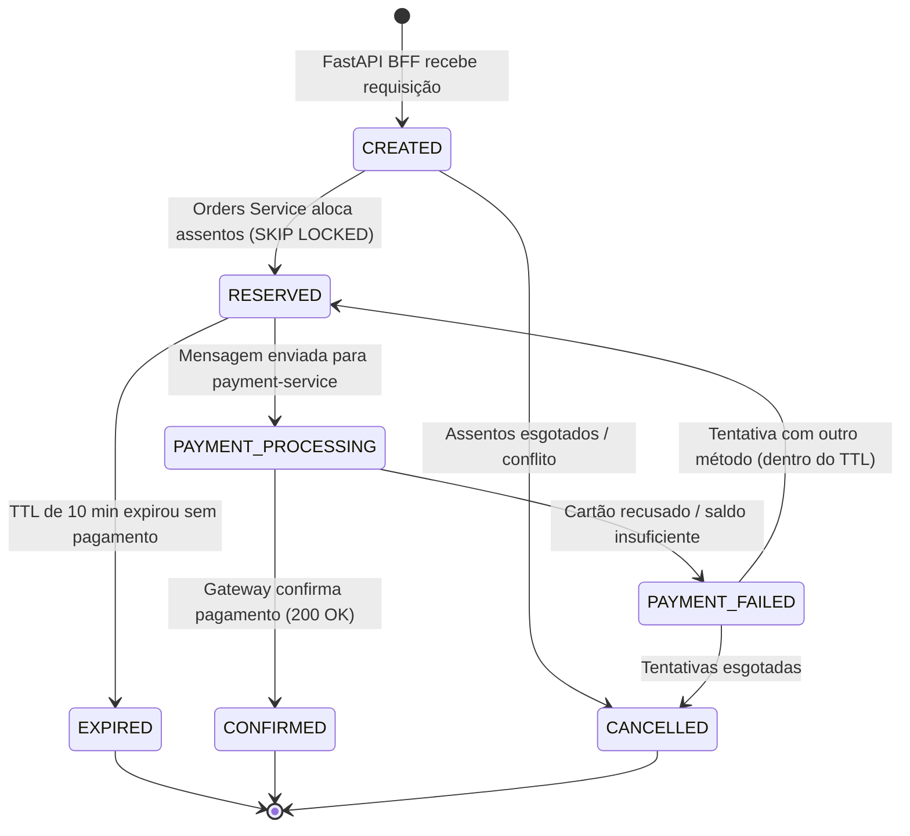
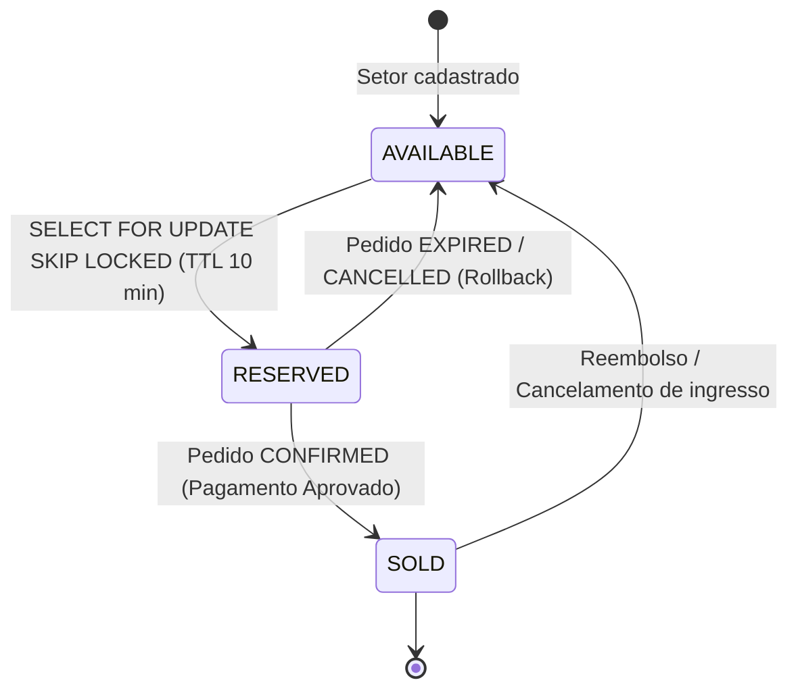
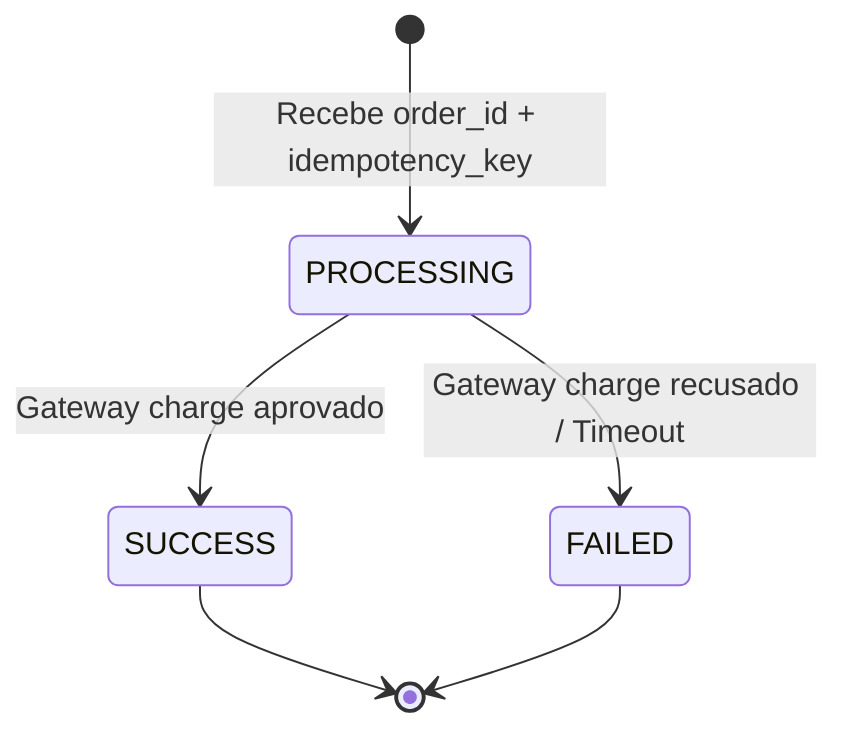

# Modelagem de Dados e Diagramas de Relacionamento (ER)

> **Documento:** Modelagem Completa de Banco de Dados — Ticket Booking System  
> **Escopo:** PostgreSQL (Transacional / Estádio por Setores), MongoDB (Catálogo & Auditoria) e Elasticsearch (Busca Textual e Filtros Facetados).

---

## 1. Visão Geral da Persistência Poliglota

O ecossistema utiliza uma estratégia de **Persistência Poliglota** onde cada banco de dados atende a um padrão de acesso e garantia de consistência específico:



---

## 2. PostgreSQL — Diagrama Entidade-Relacionamento Completo (ER)

O modelo relacional modela a venda de ingressos de **Estádios de Futebol** e arenas multiuso, onde a capacidade total é dividida por **Setores** (ex: *Arquibancada Norte*, *Cadeira Inferior Sul*, *Camarotes*) com controle de estoque e assentos individuais/contagem atômica.



---

## 3. Modelo do Estádio de Futebol (Divisão de Capacidade)



---

## 4. MongoDB — Schemas das Coleções

O MongoDB armazena dados semiesquematizados de catálogo de eventos com documentos embutidos e logs de auditoria de alta vazão:



---

## 5. Elasticsearch — Mapeamento do Índice `events`

O Elasticsearch é otimizado para busca textual com autocompletar e filtros facetados (hoje, próxima semana, faixa de preço, setor):



---

## 6. Diagrama de Sincronização Cross-Database

Como os dados fluem e sincronizam de forma orientada a eventos via **RabbitMQ**:

```mermaid
sequenceDiagram
    autonumber
    participant Admin as Gestão de Eventos
    participant Mongo as MongoDB (Catálogo)
    participant RMQ as RabbitMQ (Exchanges)
    participant SyncWorker as Search Sync Worker (Go)
    participant ES as Elasticsearch (Índice)
    participant Orders as Orders Service (Go)
    participant PG as PostgreSQL (Seats/Orders)

    Note over Admin,ES: === Cadastro e Atualização de Jogo/Evento ===
    Admin->>Mongo: Inserir Documento Evento (com Setores)
    Mongo-->>Admin: Evento Salvo (_id: 64a8...)
    Admin->>RMQ: Publica "event.created" { event_id, title, sectors[] }
    RMQ->>SyncWorker: Consome "event.created"
    SyncWorker->>ES: PUT /events/_doc/{id} (Indexação com Autocomplete Mapping)
    ES-->>SyncWorker: 201 Created

    Note over PG,ES: === Reserva de Assento e Atualização de Estoque ===
    Orders->>PG: BEGIN; SELECT ... FOR UPDATE SKIP LOCKED; UPDATE seats; COMMIT;
    Orders->>RMQ: Publica "seats.status_changed" { event_id, sector_id, delta: -2 }
    RMQ->>SyncWorker: Consome "seats.status_changed"
    SyncWorker->>ES: POST /events/_update/{id} (Script decrementa available_seats)
    ES-->>SyncWorker: 200 OK (Filtros de busca atualizados)
```

---

## 7. Diagramas de Máquinas de Estados (Lifecycle)

### 7.1 Ciclo de Vida do Pedido (`orders.status`)


### 7.2 Ciclo de Vida do Assento (`seats.status`)


### 7.3 Ciclo de Vida do Pagamento (`payments.status`)


---

## 8. Dicionário de Dados e Índices Recomendados

### 8.1 Índices de Alta Performance no PostgreSQL
```sql
-- Busca rápida de login por email
CREATE UNIQUE INDEX idx_auth_users_email ON auth_users(email);

-- Busca de perfil por CPF/Documento e FK de autenticação
CREATE UNIQUE INDEX idx_users_document ON users(document);
CREATE INDEX idx_users_auth_id ON users(auth_id);

-- Busca de endereços por usuário
CREATE INDEX idx_user_addresses_user_id ON user_addresses(user_id);

-- Hot-Path da compra de ingressos: Bloqueio de assentos livres por setor
CREATE INDEX idx_seats_locking ON seats(event_id, sector_id, status) 
WHERE status = 'AVAILABLE';

-- Histórico de pedidos do usuário
CREATE INDEX idx_orders_user_id ON orders(user_id);
CREATE INDEX idx_orders_status ON orders(status);

-- Idempotência e consulta de pagamentos por pedido
CREATE UNIQUE INDEX idx_payments_idempotency ON payments(idempotency_key);
CREATE INDEX idx_payments_order_id ON payments(order_id);
```

### 8.2 Índices no MongoDB
```javascript
// Busca de eventos por categoria e data
db.events.createIndex({ category: 1, start_time: 1 });
db.events.createIndex({ status: 1 });

// Consulta de notificações por usuário e pedido
db.notifications.createIndex({ user_id: 1, created_at: -1 });
db.notifications.createIndex({ order_id: 1 });

// Auditoria por entidade e timestamp
db.audit_logs.createIndex({ entity: 1, entity_id: 1 });
db.audit_logs.createIndex({ "metadata.trace_id": 1 });
```
