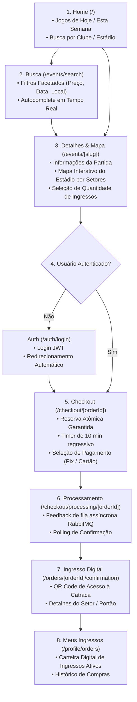
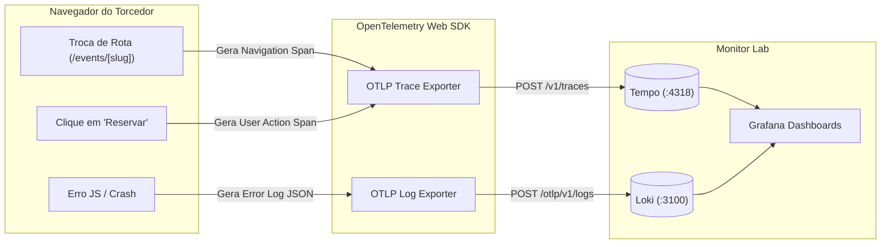

# Especificação de Rotas, Telas e Funcionalidades do Frontend (`ticket-web`)

> **Aplicação:** Portal Web do Torcedor e Comprador de Ingressos (`ticket-web`)  
> **Framework:** Next.js 15+ (App Router), React 19, TypeScript  
> **Comunicação:** Chamadas REST HTTP para o **FastAPI BFF** (`http://<tailscale-host>/api/v1/*`) via **Traefik**.

---

## 1. Fluxograma da Jornada do Usuário (User Journey)



---

## 2. Mapa Completo de Rotas

| Rota | Tipo | Objetivo / Tela | Funcionalidades Principais |
|---|---|---|---|
| `/` | Pública (SSR/ISR) | **Home / Descoberta de Jogos** | Carrossel de jogos em destaque, abas "Jogos de Hoje", "Esta Semana", "Clássicos", busca rápida |
| `/events/search` | Pública (Client) | **Busca e Filtros Facetados** | Busca textual com debounce, filtros por data, faixa de preço, estádio/cidade e ordenação |
| `/events/[slug]` | Pública (SSR + Client) | **Detalhes da Partida & Mapa do Estádio** | Informações do jogo, horário, **Mapa Interativo de Setores (SVG)**, capacidade restante em tempo real, seletor de quantidade e botão "Reservar Ingressos" |
| `/auth/login` | Pública | **Login** | Formulário de autenticação JWT, validação Zod, "Lembrar-me", link de cadastro e retorno à página anterior |
| `/auth/register` | Pública | **Cadastro de Torcedor** | Formulário com Nome, Email, CPF (validação de formato), Telefone e Senha forte |
| `/checkout/[orderId]` | Protegida (Client) | **Checkout & Pagamento (Hot-Path)** | **Timer Regressivo de 10 min**, resumo do pedido, escolha entre Pix (QR Code dinâmico) e Cartão de Crédito com `idempotency_key` |
| `/checkout/processing/[orderId]` | Protegida (Client) | **Aguardando Confirmação** | Loader animado, polling inteligente com `GetOrderStatus` via BFF para aguardar o `payment-service` |
| `/orders/[orderId]/confirmation` | Protegida (SSR) | **Confirmação & E-Ticket** | Recibo do pedido, QR Code dinâmico de acesso ao estádio, instruções de portão/entrada |
| `/profile` | Protegida | **Minha Conta** | Dados cadastrais, alteração de dados pessoais e múltiplos endereços cadastrados |
| `/profile/orders` | Protegida | **Meus Ingressos (Carteira Digital)** | Listagem de ingressos futuros com QR Code offline e histórico de partidas passadas |

---

## 3. Especificação Detalhada das Telas

---

### 3.1 Tela: Detalhes do Evento & Mapa do Estádio (`/events/[slug]`)

Esta é a tela principal de conversão do sistema. Ela renderiza o estádio dividido em setores com status visual de lotação.

#### Wireframe / Layout Conceitual:
```text
┌─────────────────────────────────────────────────────────────────────────────────┐
│ [Logo TicketWeb]   Buscar Jogos... [🔍]          Jogos | Meus Ingressos | [Perfil]│
├─────────────────────────────────────────────────────────────────────────────────┤
│                                                                                 │
│  ⚽ FLAMENGO vs PALMEIRAS — FINAL DO CAMPEONATO                                  │
│  📅 Domingo, 15 de Setembro de 2026 às 16:00  •  🏟️ Estádio do Maracanã, RJ     │
│                                                                                 │
│  ┌────────────────────────────────────────┐  ┌───────────────────────────────┐  │
│  │         MAPA INTERATIVO DO ESTÁDIO     │  │ SELECIONE SEU SETOR           │  │
│  │                                        │  │                               │  │
│  │              [ SETOR NORTE ]           │  │ 🔴 Setor Norte (Geral)        │  │
│  │            (Capacidade: 15.000)        │  │    R$ 50,00  •  8.420 livres  │  │
│  │    ┌──────────────────────────────┐    │  │    Qtd: [-] 2 [+]             │  │
│  │    │                              │    │  │                               │  │
│  │ [OESTE]        CAMPO             [LESTE│  │ 🟡 Setor Leste Inferior       │  │
│  │  VIP       (Gramado)              CADEI│  │    R$ 120,00 •  1.230 livres  │  │
│  │    │                              │    │  │    Qtd: [-] 0 [+]             │  │
│  │    └──────────────────────────────┘    │  │                               │  │
│  │              [ SETOR SUL ]             │  │ 🟣 Setor Oeste VIP            │  │
│  │            (Visitante / 10.000)        │  │    R$ 250,00 •  500 livres    │  │
│  │                                        │  │                               │  │
│  └────────────────────────────────────────┘  │ Total: R$ 100,00 (2 ingressos)│  │
│                                              │ [  RESERVAR E IR PRO PAGAMENTO  ]│
│                                              └───────────────────────────────┘  │
└─────────────────────────────────────────────────────────────────────────────────┘
```

#### Funcionalidades da Tela:
1. **Renderização SVG Interativo:** Cada setor é um path SVG com evento de clique e hover.
2. **Badge de Lotação em Tempo Real:** Indicador dinâmico de vagas disponíveis puxado via API.
3. **Reserva Imediata:** Ao clicar em "Reservar", o BFF publica `order.created` no RabbitMQ e redireciona com o `orderId` gerado.

---

### 3.2 Tela: Checkout & Pagamento com Timer (`/checkout/[orderId]`)

Esta tela implementa a proteção contra expiração da reserva atômica (`SELECT FOR UPDATE SKIP LOCKED` com TTL de 10 minutos).

#### Wireframe / Layout Conceitual:
```text
┌─────────────────────────────────────────────────────────────────────────────────┐
│                                CHECKOUT SEGURO                                  │
├─────────────────────────────────────────────────────────────────────────────────┤
│                                                                                 │
│   ⏱️ SEUS INGRESSOS ESTÃO RESERVADOS POR:  [ 09:48 ]                           │
│   Conclua o pagamento antes que a reserva expire e os assentos sejam liberados.│
│                                                                                 │
│  ┌────────────────────────────────────────┐  ┌───────────────────────────────┐  │
│  │ FORMA DE PAGAMENTO                     │  │ RESUMO DO PEDIDO              │  │
│  │                                        │  │                               │  │
│  │ (•) PIX (Aprovação Imediata)           │  │ Jogo: Flamengo vs Palmeiras   │  │
│  │ ( ) Cartão de Crédito                  │  │ Data: 15/09/2026 - 16:00      │  │
│  │                                        │  │ Setor: Setor Norte (Geral)    │  │
│  │ ┌────────────────────────────────────┐ │  │ Ingressos: 2x R$ 50,00         │  │
│  │ │ [QR CODE PIX DINÂMICO]             │ │  │ Taxa de Serviço: R$ 10,00     │  │
│  │ │                                    │ │  │                               │  │
│  │ │ Copia e Cola: 00020126580014br...  │ │  │ TOTAL: R$ 110,00              │  │
│  │ │ [ 📋 Copiar Código Pix ]           │ │  └───────────────────────────────┘  │
│  │ └────────────────────────────────────┘ │                                     │
│  │                                        │                                     │
│  │ [  JÁ REALIZEI O PAGAMENTO VIA PIX  ]  │                                     │
│  └────────────────────────────────────────┘                                     │
└─────────────────────────────────────────────────────────────────────────────────┘
```

#### Funcionalidades da Tela:
1. **Timer Sincronizado (`useCountdown`):** Contagem regressiva de 10 minutos calculada com base no `expires_at` do pedido.
2. **Alerta de Expiração Modal:** Caso o timer chegue a `00:00`, uma modal informa a expiração e oferece botão para retornar à tela do evento.
3. **Chave de Idempotência no Client:** Cada tentativa de pagamento gera um `idempotency_key` (UUID v4) para evitar dupla cobrança em cliques repetidos.

---

### 3.3 Tela: Ingresso Digital e QR Code (`/orders/[orderId]/confirmation`)

Tela exibida após a confirmação do pagamento pelo `payment-service`.

#### Wireframe / Layout Conceitual:
```text
┌─────────────────────────────────────────────────────────────────────────────────┐
│                        🎉 COMPRA CONFIRMADA COM SUCESSO!                        │
├─────────────────────────────────────────────────────────────────────────────────┤
│                                                                                 │
│   Pedido #ORD-992182  •  Comprador: João da Silva (CPF: ***.456.789-**)          │
│                                                                                 │
│  ┌───────────────────────────────────────────────────────────────────────────┐  │
│  │                        INGRESSO DIGITAL (E-TICKET)                        │  │
│  │                                                                           │  │
│  │  ⚽ FLAMENGO vs PALMEIRAS — FINAL                                          │  │
│  │  📅 15/09/2026 às 16:00  •  🏟️ Estádio do Maracanã, RJ                     │  │
│  │                                                                           │  │
│  │  📍 SETOR: NORTE (GERAL)   🚪 PORTÃO: B   🪑 ASSENTOS: LIVRE (GERAL)      │  │
│  │                                                                           │  │
│  │                        ┌─────────────────┐                                │  │
│  │                        │  █████████████  │                                │  │
│  │                        │  ██ ▄▄▄▄▄ █▀▄█  │                                │  │
│  │                        │  ██ █   █ █ ▀█  │  [ QR CODE DE ACESSO ]         │  │
│  │                        │  ██ ▀▀▀▀▀ █ ▄█  │  Apresente na catraca          │  │
│  │                        │  █████████████  │                                │  │
│  │                        └─────────────────┘                                │  │
│  │                                                                           │  │
│  │  [ ⬇️ Baixar Ingresso PDF ]    [ 📱 Adicionar à Carteira (Apple / Google) ] │  │
│  └───────────────────────────────────────────────────────────────────────────┘  │
└─────────────────────────────────────────────────────────────────────────────────┘
```

---

## 4. Integração com a Camada de Observabilidade (OTel & RUM)

Todas as páginas e interações geram telemetria enviada para a stack de monitoramento do laboratório:


