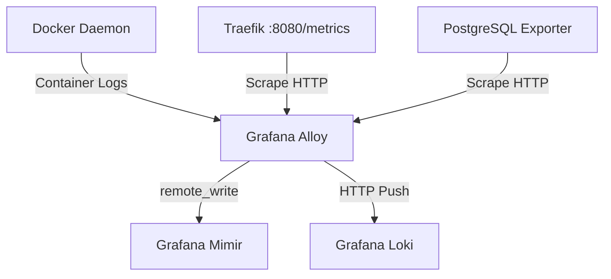

# Grafana Alloy

## 1. Visão Geral

O **Grafana Alloy** (sucessor direto do Grafana Agent e derivado forte do OpenTelemetry Collector) é uma solução unificada e agnóstica de borda. Sua única responsabilidade é coletar, processar e rotear dados de telemetria da máquina e de containers.

No Observability Lab, seu papel é ser o "catador" silencioso. As APIs se auto-instrumentam via OTLP, mas os bancos de dados, o proxy reverso e as métricas nativas do host necessitam de algo fazendo raspagem (*scraping*). O Alloy preenche esta lacuna varrendo containers, logs em terminal, e exportando nativamente tudo aos backends (Mimir e Loki).



## 2. Configuração com River Syntax

O Alloy abandonou arquivos clássicos em YAML em favor da sua própria linguagem de configuração declarativa, fortemente inspirada pelo Terraform, chamada **River**.

O arquivo `config.alloy` define blocos lógicos autônomos denominados **Components**.
Cada componente tem um propósito de entrada, processamento, ou saída, e eles interagem entre si passando valores exportados por referência, o que cria um DAG (Grafo Direcionado Acíclico) dinâmico do fluxo de telemetria.

## 3. Coleta de Logs (Containers Docker)

Um dos pontos mais fortes do Alloy é sua inteligência em orquestração. Não há necessidade de configurar um *Logstash* ou ficar montando caminhos obscuros de disco do Docker.

Utilizando componentes nativos:
1. `discovery.docker`: O Alloy é instruído a conectar no socket do daemon do Docker e auto-descobrir os containers da máquina hospedeira.
2. `loki.source.docker`: O Alloy começa a rastrear (tail) o stdout/stderr dos containers descobertos e atacha as informações essenciais como labels (ex: nome do container, namespace/compose-project, tag da imagem).

Exemplo River:
```river
discovery.docker "lab_containers" {
    host = "unix:///var/run/docker.sock"
}

loki.source.docker "lab_logs" {
    host       = "unix:///var/run/docker.sock"
    targets    = discovery.docker.lab_containers.targets
    forward_to = [loki.write.endpoint.receiver]
}
```

## 4. Coleta de Métricas (Prometheus Scrape)

O sistema legado e amplamente aceito do Prometheus baseava-se num modelo de *Pull* (o banco de dados passava recolhendo dados). O Mimir em nosso laboratório delega essa função ao Alloy.

Para coletar métricas do Traefik, por exemplo, o Alloy é ensinado a usar o módulo de scraping.
```river
prometheus.scrape "traefik_metrics" {
  targets = [
    {"__address__" = "traefik:8080"},
  ]
  forward_to = [prometheus.remote_write.mimir.receiver]
  scrape_interval = "15s"
}
```
O Alloy vai fazer uma requisição GET a cada 15 segundos em `http://traefik:8080/metrics`, extrair as informações baseadas no formato texto do Prometheus, e compactar para envios em lote (batching). 

Isso mesmo se aplica aos *exporters* associados a bancos de dados como PostgreSQL e Redis presentes no lab.

## 5. Gestão de Labels e Relabeling

Antes da telemetria ser enviada ao destino, frequentemente precisamos purificar ou manipular a informação. O componente de `relabel` (similar ao conceito nativo do Prometheus) permite mutações drásticas baseadas em Regex.

Por exemplo, podemos querer que o campo longo retornado pela API do Docker como `__meta_docker_container_name` seja reescrito e entregue ao sistema simplesmente como a label `container`.

```river
discovery.relabel "docker_logs" {
  targets = discovery.docker.lab_containers.targets

  rule {
    source_labels = ["__meta_docker_container_name"]
    regex = "/(.*)"
    target_label = "container"
  }
}
```
Esta filtragem prévia é obrigatória para manter a saúde do Mimir/Loki (mantendo a cardinalidade em níveis saudáveis e o dashboard focado unicamente nos dados relevantes).

## 6. Pipeline Dinâmico

Graças à linguagem declarativa River, é formado um *Pipeline* (Tubo).
Os fluxos ocorrem da seguinte maneira no Alloy:

- **Discovery** (Achar as fontes) → **Collect** (Extrair dados da fonte) → **Process/Relabel** (Higienizar a informação e criar labels) → **Export** (Enviar a informação)

A UI local do Grafana Alloy (geralmente exposta em uma porta dedicada como `:12345`) permite visualizar visualmente, renderizado em formato de fluxo, todos os componentes e se existem falhas em algum ponto do DAG, excelente para *troubleshooting* local.

## 7. Integração com Loki e Mimir (Endpoints de Saída)

A ponta final do fluxo do Alloy são os receptores dos bancos.
Em River, declara-se a conexão e formatação dos envios (como autenticação, tempo de batching) conectando aos serviços internos do Docker Compose.

- **Para o Loki** (Logs):
  ```river
  loki.write "endpoint" {
    endpoint {
      url = "http://loki:3100/loki/api/v1/push"
    }
  }
  ```
- **Para o Mimir** (Métricas):
  ```river
  prometheus.remote_write "mimir" {
    endpoint {
      url = "http://mimir:8080/api/v1/push"
    }
  }
  ```
  Assim, qualquer componente de captura só precisa repassar sua variável interna `forward_to` para a referência destes escritores.
