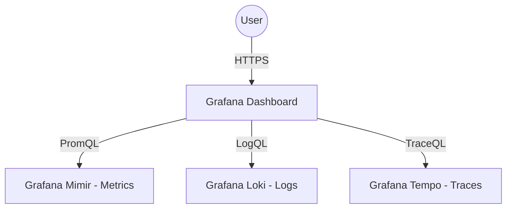

# Grafana

## 1. Visão Geral

O **Grafana** é a plataforma central de visualização e correlacionamento de dados no Observability Lab. Ele provê painéis (*dashboards*) intuitivos e ferramentas de pesquisa para todas as vertentes da telemetria: Métricas, Logs e Traces.

O grande poder do Grafana no nosso laboratório não está apenas na visualização individual desses componentes, mas na forma como ele permite navegar fluidamente entre eles — por exemplo, pulando de um erro nos Logs para o Trace da requisição problemática, e deste Trace diretamente para as Métricas da aplicação afetada.



## 2. Provisioning

Para garantir que o ambiente seja reprodutível e *Infrastructure-as-Code* (IaC), o Grafana é configurado via **Provisioning**. Isso significa que as conexões com as bases de dados e a maioria dos dashboards pré-definidos são configurados automaticamente através de arquivos YAML assim que o container sobe, eliminando a necessidade de setup manual através da interface web.

Os diretórios mapeados em volume para isso são geralmente organizados da seguinte forma:
- `/etc/grafana/provisioning/datasources/`
- `/etc/grafana/provisioning/dashboards/`

## 3. Datasources

No laboratório, configuramos três *Datasources* essenciais que formam os pilares da observabilidade.

### Mimir (Métricas)
O **Mimir** atua como o motor de armazenamento de métricas de longo prazo, compatível de forma nativa com a API do Prometheus.
- **Linguagem**: PromQL
- **URL**: `http://mimir:8080/prometheus`
- **Utilidade**: Extração de dados estatísticos (taxa de erro, CPU, Memória, Latência)

### Loki (Logs)
O **Loki** consolida todos os logs estruturados das aplicações e da infraestrutura (via Grafana Alloy e OpenTelemetry OTLP).
- **Linguagem**: LogQL
- **URL**: `http://loki:3100`
- **Derived Fields**: Uma parte essencial da configuração do Loki no Grafana é a criação de campos derivados (Derived Fields). O Grafana aplica expressões regulares nas linhas de log. Se encontrar um `trace_id`, ele transforma o valor em um link clicável que direciona o usuário imediatamente para o painel do Tempo.

### Tempo (Traces)
O **Tempo** centraliza os *traces distribuídos*, capturando o ciclo de vida completo de cada requisição conforme ela viaja pela arquitetura de microsserviços.
- **Linguagem**: TraceQL
- **URL**: `http://tempo:3200`
- **Correlação Bidirecional**: Além de receber links do Loki, o datasource do Tempo possui a configuração "Trace to logs" (onde o Tempo busca logs baseados em Trace ID, Span ID e labels) e "Trace to metrics" (que interage com Service Graphs e as RED Metrics exportadas).

## 4. Dashboards

Os *dashboards* são os recursos visuais de fato. Os dashboards pré-definidos são exportados no formato de modelo JSON (*JSON models*) e colocados em diretórios montados no container do Grafana.

A configuração de *Dashboard Provisioning* lê os arquivos de um diretório e os carrega diretamente nas pastas organizacionais (*Folders*) do Grafana na inicialização.

Estrutura esperada:
```text
grafana/
└── provisioning/
    └── dashboards/
        ├── dashboards.yaml    (Configuração que aponta pros arquivos JSON)
        ├── infrastructure/
        │   ├── traefik.json
        │   └── nodes.json
        └── applications/
            ├── users-api.json
            └── orders-api.json
```
Isso mantém o repositório sincronizado com as visões criadas no dashboard. Quaisquer mudanças feitas pela UI do Grafana devem ser exportadas novamente como JSON e commitadas para garantir a integridade da infraestrutura.

## 5. Correlação Cruzada

A correlação cruzada (*Cross-correlation* ou *Exemplars*) é a prática fundamental de observabilidade explorada no lab.

A navegação ocorre principalmente em três vetores:
1. **Logs para Traces**: Como os logs das aplicações via OpenTelemetry incluem o atributo de log `trace_id` e a configuração de Derived Fields do Loki está habilitada, sempre que um log for visualizado (ex: um erro de banco de dados no PostgreSQL retornado pelo microserviço), haverá um botão ao lado da linha que abre uma tela dividida com a visualização do Span completo no Tempo.
2. **Traces para Logs**: Ao visualizar a cascata de chamadas de um trace, existe um ícone de documento no span. Ao clicar, o Grafana utiliza os dados de metadata do Span (ex: *service.name*) para formatar uma query LogQL automática e mostrar todos os logs emitidos durante a execução específica daquele Span.
3. **Traces/Logs para Metrics**: Baseado em *Exemplars* e *Service Graphs*, os componentes injetam IDs e instâncias nas séries temporais do Mimir, permitindo pular de um gráfico genérico (como latência P99 alta) direto para um exemplo de Trace que reflete essa lentidão.

## 6. Variáveis de Ambiente

O comportamento do container do Grafana é altamente controlável através de variáveis de ambiente. Todas elas possuem o prefixo `GF_`.
Exemplos utilizados no contexto do laboratório:

- `GF_SECURITY_ADMIN_USER`: Define o nome de usuário padrão do administrador.
- `GF_SECURITY_ADMIN_PASSWORD`: Define a senha padrão.
- `GF_USERS_ALLOW_SIGN_UP`: No lab, geralmente configurado para `false` para impedir registros aleatórios.
- `GF_SERVER_DOMAIN`: O domínio base, neste caso configurado para `monitor.lab`.
- `GF_SERVER_ROOT_URL`: Fundamental para o roteamento do Traefik, especialmente se o Grafana estiver num sub-path ou um host específico (ex: `https://monitor.lab/grafana`).
- `GF_INSTALL_PLUGINS`: Utilizado para forçar a instalação de plugins não-nativos na subida do container.

## 7. Acesso

- **URL Padrão**: A plataforma fica acessível através do gateway sob o endereço predeterminado, ex: `https://monitor.lab/grafana`.
- **Credenciais**: Caso não sobrescrito por variáveis de ambiente, o padrão de acesso do Grafana é de usuário `admin` e senha `admin`. No primeiro acesso de instâncias não-provisionadas dessa forma, o Grafana forçará a troca.
- **Porta Interna**: Para o roteamento do loadbalancer (Traefik), deve ser lembrado que o Grafana escuta nativamente na porta `3000`. Essa é a porta que deve ser exposta nas labels do Docker.
