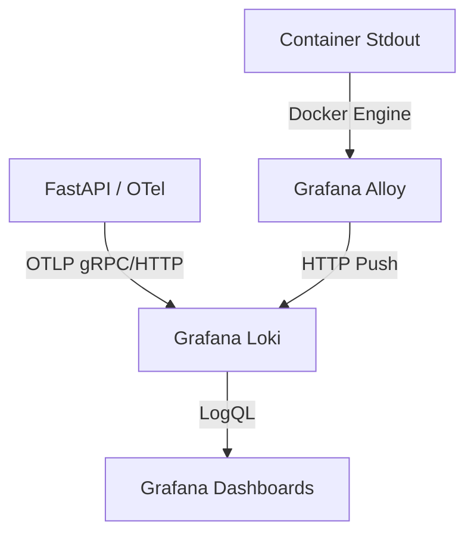

# Grafana Loki

## 1. Visão Geral

O **Grafana Loki** é um agregador de logs altamente disponível e multilocatário (multitenant) inspirado diretamente no Prometheus. Diferente de soluções tradicionais de mercado para logs (como ELK / Elasticsearch), o Loki foca unicamente em construir e gerenciar um índice de metadados (*labels*), deixando o conteúdo bruto do log (texto não indexado) armazenado em chunks comprimidos no disco ou no *object storage*.

Isto o torna extremamente leve e incrivelmente rápido e eficiente no consumo de recursos da máquina. No Observability Lab, o Loki armazena de forma estruturada todos os eventos JSON provenientes das APIs e dados brutos extraídos do stdout de containers.



## 2. Configuração

Para ambientes locais, o Loki pode ser implantado como um binário monolítico único. Toda a sua configuração é centralizada no `config.yml`. Assim como o Mimir, rodamos o Loki desativando a necessidade de *multitenancy* (variável `auth_enabled: false`) para facilitar o entendimento dos conceitos principais.

Partes essenciais do `config.yml`:
- **Server**: Configurações HTTP (`3100`) e gRPC (`9095`).
- **Ingester**: Gerencia as requisições de ingestão. Mantém os chunks em memória antes de repassá-los para o armazenamento.
- **Storage_config**: Como dito na arquitetura, no modo standalone local os dados (índices BoltDB/TSDB e os arquivos compactados das linhas de logs) ficam armazenados via *filesystem*. 
- **Limits_config**: Proteções e garantias operacionais (ex: tamanho de retenção, políticas de drop para logs desatualizados).

## 3. Ingestão de Dados

A flexibilidade do Loki permite que ele receba informações de múltiplas formas no laboratório:

### OTLP Endpoint Nativo
Graças à evolução do ecossistema, o Loki agora suporta OTLP sem precisar que os dados passem necessariamente por um tradutor como o Alloy ou OpenTelemetry Collector. Aplicações enviam logs estruturados em OTLP diretamente para a porta `:3100` do Loki, onde ele mapeia as labels do *Resource* do Trace para *labels* do Loki automaticamente.

### HTTP Push API (Via Alloy)
Para serviços legados, bancos de dados e ferramentas de terceiros que apenas escrevem logs em tela preta (stdout/stderr) ou arquivo, utilizamos o **Grafana Alloy** lendo os containers Docker. O Alloy usa o endpoint genérico `POST /loki/api/v1/push` para fazer a entrega estruturada das linhas lidas.

## 4. Consultas com LogQL

O Loki dispõe de uma linguagem poderosa análoga ao PromQL chamada **LogQL**. É dividida entre *Stream Selectors* e *Log Pipeline Filters*.

Exemplos de como usá-lo:

1. **Stream Selectors (Filtros baseados em Labels)**
   Seleciona de qual aplicação o log veio.
   ```logql
   {app="users-api"}
   ```

2. **Line Filters e Label Filters**
   Dentro do contexto, fazer o parsing do JSON, e então buscar por um código de erro exato na estrutura.
   ```logql
   {app="users-api"} |= "error" | json | status >= 500
   ```

3. **Pesquisa exata de Trace ID**
   Graças ao OpenTelemetry instrumentando os logs, os *trace IDs* compõem parte vital do debug.
   ```logql
   {app="orders-api"} | json | trace_id="5b8aa5a2d2c858479e0a2db7a3dbf20c"
   ```

## 5. Práticas de Labels (Gestão de Cardinalidade)

O principal erro ao utilizar o Loki é indexar conteúdo excessivo. A filosofia é: *apenas metadados estáticos e comuns devem ser Labels, o resto entra como payload de JSON não indexado*.

- **Bons exemplos de Labels**: `env`, `service.name`, `app`, `container`, `level`.
- **Péssimos exemplos de Labels** (Não usar): `trace_id`, `user_id`, `ip_address`, `session_id`. Se transformar o `trace_id` em label, o Loki estourará sua cardinalidade, alocando gigabytes de índice para dados que ocorrem apenas uma vez. Extraia esses dados unicamente via *log pipeline filters* (o operador `| json`).

## 6. Integração com Grafana e Derived Fields

A configuração de Datasource no Grafana é apontada para `http://loki:3100`. 
O pulo do gato na integração no Grafana é o sistema de **Derived Fields**.

Nas configurações do Datasource, informamos que o Loki deve varrer o payload dos logs recebidos procurando por uma Regex, por exemplo:
```regex
"trace_id":\s*"(\w+)"
```
Quando o Grafana encontrar esta string no log visualizado na tela, ele a exibirá como um link clicável. Ao clicar neste link, o Grafana utiliza a URL configurada no *Derived Field* para despachar o usuário para o *datasource* do **Grafana Tempo**, passando o valor extraído da Regex diretamente como query. O resultado é ir do erro no log para a visualização gráfica das requisições afetadas em apenas 1 clique.

## 7. Integração com OpenTelemetry

Através do módulo de logs do `opentelemetry-sdk` em Python, configuramos a aplicação para enviar cada `logging.info()` (ou error/warning) atrelado ao Span atual da requisição.

Isto significa que no formato de saída OTLP para o Loki:
- `trace_id` e `span_id` são embutidos nas metainformações.
- Labels provenientes de variáveis de ambiente (`OTEL_RESOURCE_ATTRIBUTES`) são mapeados nas Labels do Loki.
- O formato final de entrega é perfeitamente JSON (Structured Logging), dispensando que programadores tentem aplicar RegEx manual no Splunk/Grafana para achar quem fez a requisição.
