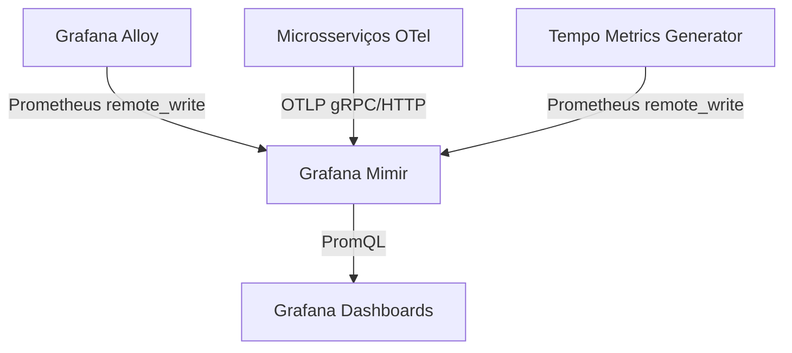

# Grafana Mimir

## 1. Visão Geral

O **Grafana Mimir** é um banco de dados de séries temporais (*TSDB - Time Series Database*) de código aberto. Ele oferece armazenamento de longo prazo, altamente escalável e de alta disponibilidade para métricas no ecossistema do Prometheus.

No Observability Lab, o Mimir assume a função que normalmente seria do Prometheus tradicional. No entanto, sua arquitetura nativamente pronta para nuvem, o gerenciamento de retenção otimizado em blocos, e o suporte robusto a ingestão remota (*remote_write* e *OTLP* nativo) o tornam a melhor escolha para um lab focado em tecnologias de observabilidade modernas e modernas práticas OTLP.



## 2. Configuração

Para o ambiente de estudo em Docker Compose, a arquitetura distribuída e modular do Mimir (onde injetores, compiladores, compactadores e roteadores rodam de forma independente) é simplificada. Utilizamos o **modo monolítico** (target `all`). 

Este modo empacota todos os componentes de leitura e escrita do Mimir dentro de um único processo de container. O arquivo de configuração principal é o `mimir.yml`.

### Multitenancy
Apesar do Mimir ser primariamente construído como um banco de dados multi-inquilino (Multitenant), nós o desativamos propositalmente na configuração para evitar complicações com chaves de acesso (auth tokens e X-Scope-OrgID) e focar no aprendizado de consultas, ingestão e observabilidade de aplicação pura.
```yaml
multitenancy_enabled: false
```

## 3. Ingestão de Dados

A ingestão de métricas para o Mimir pode ser feita a partir de três grandes fluxos no lab:

### OpenTelemetry OTLP Endpoint
O Mimir suporta nativamente a ingestão de dados em formato OTLP (o protocolo padrão da CNCF e do OpenTelemetry). 
Aplicações escritas em Python utilizando o SDK do OpenTelemetry, como o `users-api`, enviam suas métricas diretamente (ex: via porta `8080` ou `4317` gRPC do Mimir/Alloy), sem a necessidade de expor um endpoint `/metrics` para scraping HTTP (modelo *Push* em vez de *Pull*).

### Prometheus remote_write
O **Grafana Alloy**, coletando métricas sistêmicas de containers, rede e infraestrutura (Traefik, PostgreSQL, Redis), envia essas métricas para o Mimir através do protocolo `remote_write` do Prometheus.
Também recebemos métricas geradas pelo backend de Trace (Tempo), os chamados *Service Graphs*.

### Configuração de Escuta
As portas habituais para ingestão e consulta no Mimir no contexto monolítico são a `8080` para API HTTP (compatível com PromQL e Ingest OTLP HTTP).

## 4. Consultas e PromQL

Com as métricas dentro do Mimir, elas são consultadas e exploradas pelo Grafana utilizando a linguagem padrão do mercado: **PromQL** (*Prometheus Query Language*).

Exemplos clássicos de consultas PromQL para as aplicações (APIs FastAPI):

- **Taxa de requisições por segundo (Throughput)**
  ```promql
  sum(rate(http_server_requests_total{service_name="users-api"}[5m]))
  ```
- **Taxa de erro (Percentage of HTTP 5xx over total)**
  ```promql
  sum(rate(http_server_requests_total{status=~"5.*"}[5m])) 
  / 
  sum(rate(http_server_requests_total[5m])) * 100
  ```
- **Latência média da API e Percentis (P95)**
  ```promql
  histogram_quantile(0.95, sum(rate(http_server_request_duration_seconds_bucket[5m])) by (le))
  ```

## 5. Storage (Armazenamento)

Diferente do Prometheus, que utiliza blocos gigantes em seu TSDB local, o armazenamento do Mimir funciona consolidando os dados temporários em blocos compatíveis com serviços de armazenamento de objetos em nuvem (*S3, GCS, Azure Blob*). 
No Observability Lab, usamos o backend de armazenamento `filesystem` (arquivos locais).

Esta configuração cria blocos imutáveis dentro de um diretório montado, sendo geridos pelo compactor, que é responsável por otimizar e unificar os blocos pequenos para garantir uma boa taxa de compressão. A política de retenção (`retention_period`) pode ser configurada para descartar métricas antigas (ex: acima de 7 dias) visando poupar disco da máquina do desenvolvedor.

## 6. Integração com Grafana

A conexão entre o Grafana e o Mimir não requer plugins especiais. No arquivo de provisionamento de datasources do Grafana, configuramos o Mimir como um simples *Datasource do Prometheus*:

```yaml
apiVersion: 1
datasources:
  - name: Mimir
    type: prometheus
    access: proxy
    url: http://mimir:8080/prometheus
    isDefault: true
    jsonData:
      httpMethod: POST
```
Usar o método HTTP `POST` previne que consultas PromQL complexas ou muito longas acabem sofrendo bloqueios de restrição de tamanho de URL no Traefik ou outro router na cadeia.

## 7. Integração com OpenTelemetry

O ecossistema OpenTelemetry permite padronizar a exportação das métricas.
Para enviar dados da API, configura-se o OTLP Exporter na aplicação:
```python
from opentelemetry.exporter.otlp.proto.http.metric_exporter import OTLPMetricExporter
from opentelemetry.sdk.metrics.export import PeriodicExportingMetricReader

# Envia métricas para o Mimir diretamente via OTLP HTTP
exporter = OTLPMetricExporter(endpoint="http://mimir:8080/otlp/v1/metrics")
reader = PeriodicExportingMetricReader(exporter)
```
Além de aplicações customizadas, coletores como o Grafana Alloy podem atuar como intermediários que recebem OTLP e o convertem em `remote_write` para o Mimir, facilitando relabeling na borda (edge).
