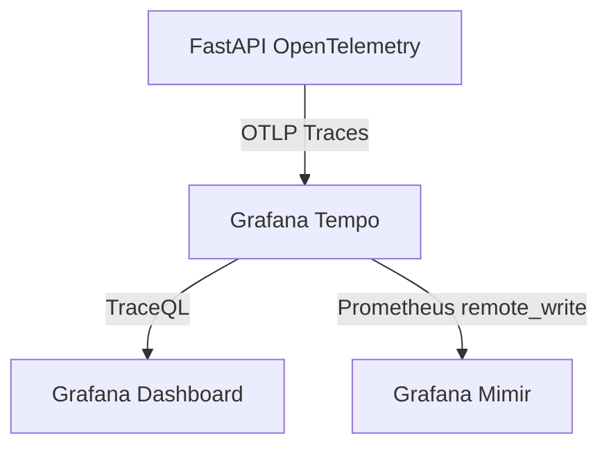

# Grafana Tempo

## 1. Visão Geral

O **Grafana Tempo** é um backend open-source, massivamente escalável e focado em custo/benefício, voltado para *Tracing Distribuído* (rastreamento de dados através de microsserviços).

A finalidade primária do Tempo na arquitetura do Observability Lab é aceitar *spans* de aplicações instrumentadas com o OpenTelemetry, armazená-las no disco, e então devolvê-las ao Grafana para a visualização unificada (gerando gráficos de Gantt que desenham uma teia de dependências, como uma API que bate num Banco de Dados PostgreSQL passando pelo cache do Redis).



## 2. Configuração

O Tempo funciona lendo um arquivo manifesto simples: o `tempo.yml`. Como as outras stacks do lab, roda no modo *single-binary* (*monolith*) de fácil gestão, concentrando coletores e compiladores num único processo.

Um bloco fundamental de configuração no Tempo são os **Receivers**. Eles dizem por quais portas e quais protocolos ele espera o recebimento dos Traces (spans). 

Para o nosso cenário adotamos o padrão absoluto de mercado OTLP, ativando tanto o protocolo gRPC (porta `4317`) quanto o HTTP (porta `4318`):
```yaml
distributor:
  receivers:
    otlp:
      protocols:
        grpc:
          endpoint: 0.0.0.0:4317
        http:
          endpoint: 0.0.0.0:4318
```

## 3. Ingestão de Dados

O Tempo aceita a família de protocolos (Jaeger, Zipkin), porém no contexto do laboratório moderno o OTel SDK envia nativamente na porta `4317` gRPC. 
Toda vez que a `users-api` recebe um GET, o middleware OpenTelemetry cria um Span. Esse Span possui início, fim, e uma lista de atributos capturados (SQL querie executada, código HTTP retornado). Ao finalizar a requisição, esse Span é serializado e feito push direto para o Tempo.

## 4. Consultas com TraceQL

Originalmente o Tempo foi projetado apenas para buscas pontuais onde você já possui o `trace_id`. Contudo, ele desenvolveu uma linguagem de pesquisa própria avançada: **TraceQL**.

O TraceQL permite pesquisar a teia de dados complexos:

1. **Buscar todos os Traces de um serviço que duraram mais de 1 segundo:**
   ```traceql
   { resource.service.name = "users-api" && duration > 1s }
   ```

2. **Buscar Traces que terminaram num código de Erro:**
   ```traceql
   { status = error }
   ```

3. **Buscar uma rota específica que tenha dependência numa tabela SQL:**
   ```traceql
   { http.target = "/users" } >> { db.statement =~ ".*SELECT.*" }
   ```

## 5. Metrics Generator (Service Graphs)

Uma das magias mais interessantes do Tempo moderno documentadas neste lab é o **Metrics Generator**. 
Geralmente, desenhar um mapa das dependências e serviços (Service Graph) e deduzir a latência do sistema exigiria instrumentar as próprias aplicações. 
No entanto, o Tempo, por examinar a vida e o fluxo de todos os *spans* trafegados, consegue inferir o comportamento de saúde de todo o ambiente de forma nativa. 

Ele pega essas informações processadas (quantas chamadas entre A e B, tempo médio), gera uma série temporal delas (RED metrics: *Rate, Errors, Duration*), e a repassa para um sistema de métricas usando `remote_write`. 
No nosso sistema, o Tempo processa isso e exporta para o `Mimir`. Isso permite ao Grafana desenhar o mapa de serviços da arquitetura 100% de graça, sem esforço de instrumentação extra do dev.

## 6. Storage

O modelo do Tempo espelha o do Loki. Para garantir baixíssimo custo de uso, ele armazena o grosso dos traces dentro de um modelo em blocos compatível com Object Storage (S3) ou Local Filesystem, descartando a necessidade de clusters de Apache Cassandra ou Elasticsearch para o índice.

No lab a retenção (`retention`) é configurada no `tempo.yml` em 48 a 72 horas para minimizar a pegada no disco, limpando dados através da diretiva do *compactor*.

## 7. Integração com Grafana e Correlação

O Datasource do Tempo conecta na URL `http://tempo:3200`.

- **Trace to Logs**: O Grafana sabe que cada *Span* tem metadados embutidos. Configurando o Tempo para se conectar ao datasource do Loki, um botão é liberado na visualização do trace que gera a pesquisa: `{service.name="users-api"} | json | trace_id="123"` - indo diretamente ao log daquela execução.
- **Trace to Metrics**: Usando as tags injetadas no span (como o *pod* Kubernetes ou *container ID*), o Tempo pode gerar um atalho que pula para o painel de uso de CPU (Mimir) especificamente daquele serviço no exato intervalo de tempo analisado no Span.

## 8. Integração com OpenTelemetry (OTel SDK)

A peça que falta no lado do servidor em Python (FastAPI):
```python
from opentelemetry.exporter.otlp.proto.grpc.trace_exporter import OTLPSpanExporter
from opentelemetry.sdk.trace.export import BatchSpanProcessor

# Configura o destino dos Traces para o endpoint gRPC do Tempo
otlp_exporter = OTLPSpanExporter(endpoint="http://tempo:4317", insecure=True)
span_processor = BatchSpanProcessor(otlp_exporter)
```

Nesse cenário, todo contexto (`W3C Trace Context`) recebido pelos cabeçalhos da requisição HTTP entrante (propagação via Traefik ou outro frontend) é mantido, e todo processamento em seguida terá o mesmo `trace_id` raiz, garantindo a unificação dentro da interface do Grafana.
