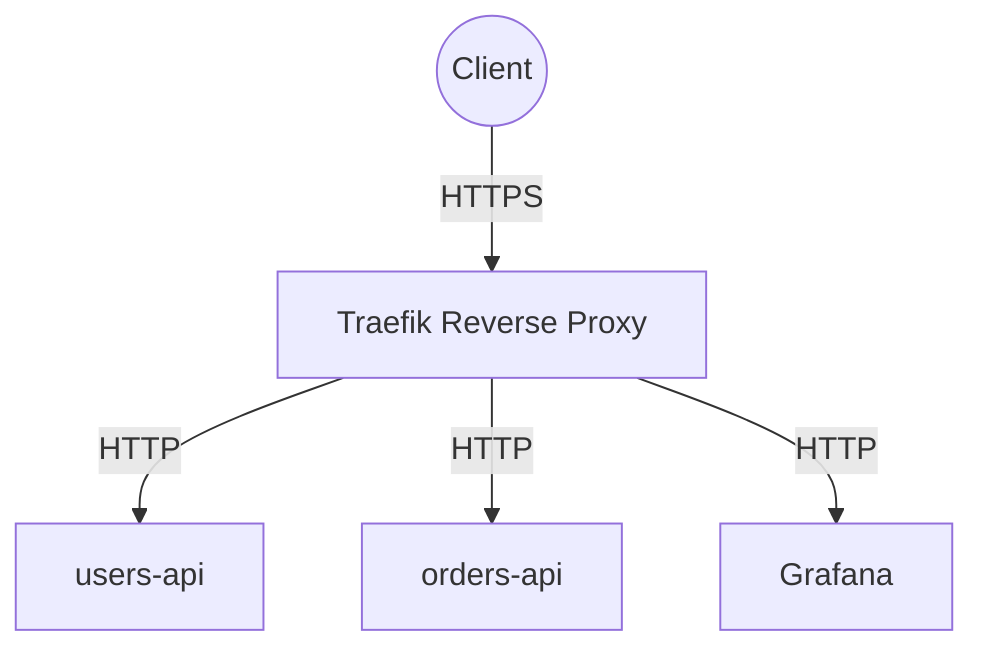
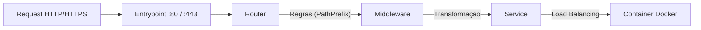

# Traefik

## 1. Visão Geral

O **Traefik** é o componente central de roteamento do Observability Lab. Ele atua como um *Reverse Proxy* e *API Gateway* moderno e dinâmico, projetado especificamente para microsserviços. 

No contexto da nossa infraestrutura, o Traefik é responsável por:
- **Reverse Proxy**: Receber todas as requisições externas e roteá-las para os serviços internos corretos (containers Docker).
- **API Gateway**: Centralizar configurações de segurança, rate limiting e autenticação antes que a requisição chegue ao microsserviço.
- **Service Discovery**: Detectar automaticamente novos microsserviços à medida que são iniciados no Docker, sem a necessidade de reconfiguração manual.
- **TLS Termination**: Gerenciar os certificados SSL/TLS e garantir a comunicação segura via HTTPS, repassando o tráfego em texto plano ou criptografado para os serviços de backend, conforme necessário.



## 2. Configuração

A configuração do Traefik no Observability Lab é dividida em estática e dinâmica.
A configuração estática é definida primariamente no arquivo `traefik.yml` e é carregada na inicialização do serviço.

### Entrypoints

Os *Entrypoints* definem as portas de rede onde o Traefik escutará as requisições recebidas.
- **web**: Escuta na porta `80` (HTTP). Ponto de entrada padrão para o tráfego da rede Tailscale.
- **websecure**: Escuta na porta `443` (HTTPS). Ponto de entrada seguro.
- **traefik**: Escuta na porta `8080`. Reservado para o acesso ao *Dashboard* interno e à API de métricas do próprio Traefik.

Exemplo de configuração estática (`traefik.yml`):
```yaml
entryPoints:
  web:
    address: ":80"
  websecure:
    address: ":443"
  traefik:
    address: ":8080"
```

## 3. Roteamento

O Traefik utiliza um sistema de roteamento inteligente e flexível baseado em *Routers*, *Services* e *Middlewares*. Estes são comumente definidos de forma dinâmica através de *Docker labels* em cada microsserviço.



- **Routers**: Analisam a requisição (baseado em critérios como PathPrefix, Headers) e decidem para qual serviço a requisição deve ser encaminhada.
- **Middlewares**: Permitem interceptar e processar a requisição antes de repassá-la ao serviço (ex: modificar headers, rate limiting, strip prefix).
- **Services**: Recebem as requisições do Router e as repassam para o(s) container(s) de destino final. Caso haja múltiplas instâncias de um serviço, o Service lida automaticamente com o balanceamento de carga (Load Balancing).

## 4. Segurança e TLS no Ambiente Tailscale

No ambiente com Tailscale VPN, todo o tráfego que trafega entre os nós da rede mesh é **automaticamente criptografado de ponta a ponta via WireGuard**, tornando o acesso via HTTP (`http://<node-name>.<tailnet>.ts.net`) 100% seguro contra interceptação de rede.

### Opções para HTTPS (TLS) com Tailscale

Caso deseje ter o "cadeado verde" (HTTPS) no navegador para o domínio Tailscale:

1. **Tailscale Serve (Recomendado):** O próprio daemon do Tailscale no servidor obtém e renova certificados Let's Encrypt automaticamente para `*.ts.net`. Basta rodar no host:
   ```bash
   tailscale serve --bg 80
   ```
   Isso expõe `https://<node-name>.<tailnet>.ts.net` na porta 443 do Tailscale e repassa o tráfego para a porta 80 do Traefik de forma transparente.

2. **Tailscale Cert no Traefik:** Gerar o par de chaves com:
   ```bash
   tailscale cert <node-name>.<tailnet>.ts.net
   ```
   Mover os arquivos para `traefik/certificates/` e habilitar no `traefik/dynamic/tls.yml`.

## 5. Service Discovery

Um dos pontos mais fortes do Traefik é a sua integração fluida com orquestradores. No nosso caso, o Traefik está configurado para usar o **Docker provider**.
Ele assina eventos da Docker engine conectando-se ao socket do Docker (`unix:///var/run/docker.sock`).

Sempre que um novo container sobe, o Traefik inspeciona as suas *labels*. Se as configurações do Traefik forem encontradas, o roteador correspondente e as regras de proxy são gerados de forma automática, permitindo o roteamento imediato, *sem necessidade de restart* da infraestrutura ou do proxy.

## 6. Middlewares

Os Middlewares no Traefik manipulam a requisição ou a resposta. Exemplos aplicáveis no laboratório:

- **StripPrefix**: Remove uma parte da URL original antes de rotear a requisição. Ex: A requisição chega no gateway como `/mimir/...`, mas o middleware remove `/mimir` para que a aplicação final receba a rota raiz.
- **Headers**: Usado para injetar ou remover cabeçalhos HTTP. Pode ser utilizado para adicionar cabeçalhos de segurança estritos (HSTS, CORS, etc).
- **RateLimiting**: Limita a taxa de requisições por IP, garantindo que nenhum serviço interno sofra sobrecarga.
- **BasicAuth**: Requer autenticação do tipo HTTP Basic antes de dar continuidade à requisição. É uma forma simples de proteger rotas internas críticas, como dashboards.

## 7. Health Checks

Para evitar encaminhar tráfego para instâncias não saudáveis, o sistema de roteamento confia em *Health Checks*. 
No ecossistema Traefik + Docker:
1. **Container Health Checks (Docker)**: O Docker realiza a checagem do container. Quando configurado corretamente, o Traefik apenas envia tráfego para containers classificados como "healthy".
2. **Traefik Health Probes**: Opcionalmente, pode-se configurar o Traefik para bater num endpoint de health check do container.

## 8. Dashboard

O Dashboard do Traefik fornece uma interface web interativa para inspeção e depuração de regras de roteamento, exibindo o estado em tempo real de todos os Entrypoints, Routers, Middlewares e Services.

### Configuração e Acesso

- **Entrypoint**: `traefik` (porta `:8080`)
- **URL**: `http://<tailscale-host>:8080/dashboard/` (ex: `http://homelab.tailxxxx.ts.net:8080/dashboard/` ou `http://100.x.y.z:8080/dashboard/`)
- **Segurança**: O modo `api.insecure` está explicitamente **desabilitado** (`insecure: false` em `traefik/traefik.yml`). O acesso ao dashboard e à API interna (`api@internal`) é exposto exclusivamente através de um router protegido com o middleware **BasicAuth**.
- **Autenticação**: Gerenciada pelo arquivo de configuração dinâmica `traefik/dynamic/dashboard.yml`.

### Credenciais Padrão e Customização

O ambiente local vem pré-configurado com as credenciais padrão de desenvolvimento:
- **Usuário**: `admin`
- **Senha**: `admin`

Para alterar ou adicionar novos usuários, gere um novo hash htpasswd:
```bash
htpasswd -nb <usuario> <senha>
```
E adicione a linha resultante na lista `users` do middleware `dashboard-auth` em `traefik/dynamic/dashboard.yml`:

```yaml
http:
  routers:
    dashboard:
      rule: "PathPrefix(`/api`) || PathPrefix(`/dashboard`)"
      entryPoints:
        - traefik
      service: api@internal
      middlewares:
        - dashboard-auth

  middlewares:
    dashboard-auth:
      basicAuth:
        realm: "Traefik Dashboard"
        users:
          - "admin:$apr1$0ZD.qXtf$7HNOJuB5EOndJZhMsyyXm1"
```

## 9. Integração com Microsserviços

Adicionar uma nova API no cluster (como a `users-api` ou `fastapi-bff`) é tão simples quanto prover as tags no seu manifesto `docker-compose.yml`:

```yaml
services:
  users-api:
    image: lab/users-api:latest
    labels:
      - "traefik.enable=true"
      - "traefik.http.routers.users.rule=PathPrefix(`/users`)"
      - "traefik.http.routers.users.entrypoints=web,websecure"
      - "traefik.http.services.users.loadbalancer.server.port=8000"
```
Quando o container é iniciado, a rota `/users` é dinamicamente criada e repassada para a porta interna 8000 do container.

## 10. Métricas

Visibilidade de borda é crucial. O Traefik expõe métricas internas como contagem de requisições totais, tempos de resposta de roteamento e taxas de erro diretamente no formato Prometheus.

No arquivo `traefik.yml`, habilitamos o módulo de métricas:
```yaml
metrics:
  prometheus:
    addEntryPointsLabels: true
    addRoutersLabels: true
    addServicesLabels: true
```
O **Grafana Alloy** raspa essas métricas periodicamente via `traefik:8080/metrics` e envia para o Grafana Mimir.

## 11. Troubleshooting

Problemas frequentes de roteamento e soluções:

- **Erro 404 Not Found**: Significa que o Traefik não encontrou nenhuma regra de Router aplicável à requisição (PathPrefix não bate). Verifique a sintaxe da label `traefik.http.routers.<nome>.rule`.
- **Erro 502 Bad Gateway**: O Router existe, mas o Traefik não consegue se comunicar com o container de destino. Geralmente ocorre se o port setado em `loadbalancer.server.port` estiver incorreto ou o container não estiver ligado na rede Docker correta (`observability-net`).
