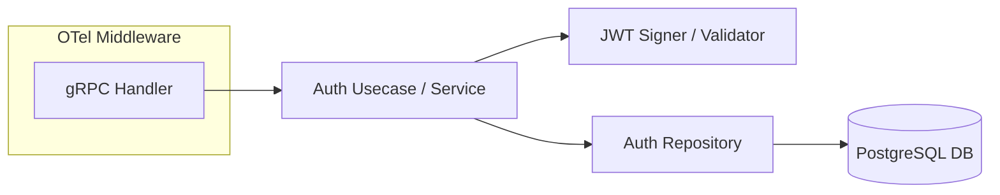
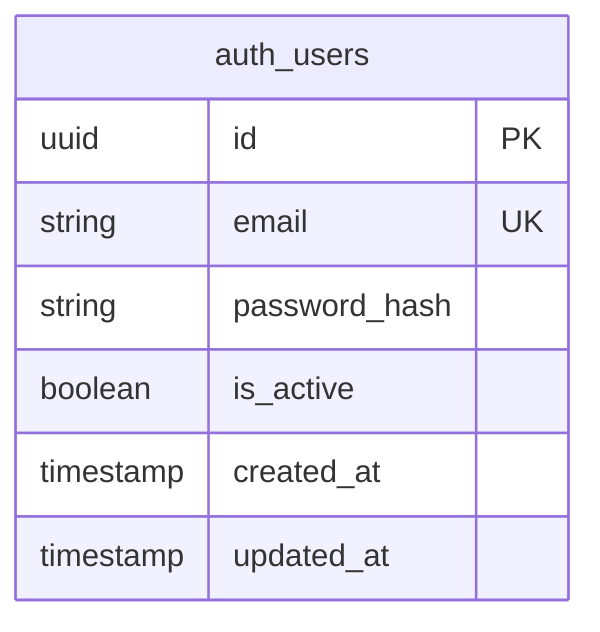

# Auth Service

> **Documentação de Arquitetura e Engenharia**  
> **Status:** Draft | **Versão:** 1.0.0

## 1. Visão Geral e Contratos

O **Auth Service** é um microsserviço síncrono ultra-rápido desenvolvido em **Golang 1.23+**. Ele gerencia identidades, credenciais e a emissão/validação de tokens JWT. 

Como não é exposto diretamente à internet, todo o tráfego entra através do BFF via **gRPC** na porta `:50051`. Ele garante segurança por meio do algoritmo bcrypt para hashing de senhas e JWT assinado com chaves assimétricas ou simétricas fortes.

### Responsabilidades:
1. Validação de credenciais e emissão de tokens de acesso e refresh.
2. Introspecção de JWT para outros microsserviços (autorização).
3. Hashing de senhas seguro.
4. Persistência de dados sensíveis na tabela `auth_users` no PostgreSQL.

---

## 2. Protobuf Definition (`auth.proto`)

```protobuf
syntax = "proto3";

package auth;
option go_package = "observability-lab/auth-service/proto";

service AuthService {
  rpc Login (LoginRequest) returns (LoginResponse);
  rpc Register (RegisterRequest) returns (RegisterResponse);
  rpc ValidateToken (ValidateTokenRequest) returns (ValidateTokenResponse);
  rpc RefreshToken (RefreshTokenRequest) returns (RefreshTokenResponse);
}

message LoginRequest {
  string email = 1;
  string password = 2;
}

message LoginResponse {
  string access_token = 1;
  string refresh_token = 2;
  int64 expires_in = 3;
}

// Omitted details for Register, ValidateToken, RefreshToken for brevity...
```

---

## 3. Arquitetura Interna em Go

A arquitetura segue o padrão Clean Architecture, garantindo separação rígida de responsabilidades e facilitando testes unitários e mocks.



Camadas:
* **Transport:** Servidor gRPC com middlewares de Logging e Tracing.
* **Usecase:** Lógica de negócios (comparação de bcrypt, validação de regras de domínio).
* **Repository:** Abstração de persistência via `pgx` e `sqlc`.

---

## 4. Modelo de Dados

O banco de dados PostgreSQL lida com a tabela dedicada à autenticação.



* **Indexação:** Índice único em `email` otimizado para operações de login rápido.
* **Segurança:** A senha crua nunca passa do escopo do usecase; apenas o hash é persistido.

---

## 5. Estrutura de Diretórios em Go

O projeto segue o *Standard Go Project Layout*.

```text
auth-service/
├── cmd/
│   └── server/
│       └── main.go               # Setup server, DI, gRPC listen
├── internal/
│   ├── config/                   # Carregamento de env vars
│   ├── handler/
│   │   └── grpc/                 # Implementação do AuthServiceServer
│   ├── usecase/
│   │   └── auth_usecase.go       # Regras de negócio, bcrypt
│   ├── repository/
│   │   ├── postgres/             # Implementação sqlc
│   │   └── queries.sql           # Queries raw para o sqlc
│   └── pkg/
│       ├── jwt/                  # Funções puras de geração JWT
│       └── telemetry/            # OTel provider init
├── proto/
│   └── auth.proto                # Arquivo fonte protobuf
├── Dockerfile
├── go.mod
└── go.sum
```

---

## 6. Variáveis de Ambiente

```env
APP_ENV=production
GRPC_PORT=50051

# Database
DB_HOST=postgres
DB_PORT=5432
DB_USER=admin
DB_PASSWORD=secret
DB_NAME=ticket_db
DB_SSLMODE=disable

# Security
JWT_SECRET=super_secret_key_change_me_in_prod
JWT_EXPIRATION_MINUTES=15
REFRESH_EXPIRATION_DAYS=7

# OpenTelemetry
OTEL_EXPORTER_OTLP_ENDPOINT=http://alloy:4317
OTEL_SERVICE_NAME=auth-service
```

---

## 7. Dockerfile Multi-stage build

```dockerfile
# Build Stage
FROM golang:1.23-alpine AS builder
WORKDIR /app
COPY go.mod go.sum ./
RUN go mod download
COPY . .
RUN CGO_ENABLED=0 GOOS=linux GOARCH=amd64 go build -o auth-service ./cmd/server/main.go

# Run Stage
FROM alpine:3.19
WORKDIR /app
COPY --from=builder /app/auth-service .
EXPOSE 50051
CMD ["./auth-service"]
```

---

## 8. Observabilidade OTel SDK

O serviço Go é estritamente monitorado usando o SDK oficial do OpenTelemetry para Go:
* **Tracing Interceptors:** Uso do `go.opentelemetry.io/contrib/instrumentation/google.golang.org/grpc/otelgrpc` para extrair contextos do BFF automaticamente.
* **Métricas:** Histograma de latência das chamadas RPC e contagem de status codes via OTLP.
* **Logs Estruturados:** Utilização intensiva do pacote `log/slog` introduzido no Go 1.21, formatando a saída para JSON e anexando via custom handler o `trace_id` e `span_id` extraídos do `context.Context`.

---

## 9. Checklist de Produção

- [ ] Rate limit gRPC interceptor habilitado (prevenção contra força bruta em logins internos, caso necessário).
- [ ] Conexões com DB usando poolers adequados via `pgxpool`.
- [ ] Configuração do custo do `bcrypt` ajustado (mínimo de 10).
- [ ] TLS desativado apenas para tráfego local dentro da rede Docker (em prod enterprise gRPC usa mTLS).
- [ ] Validação de timeouts nos contexts passados aos DB calls (ex: máximo 1s).
