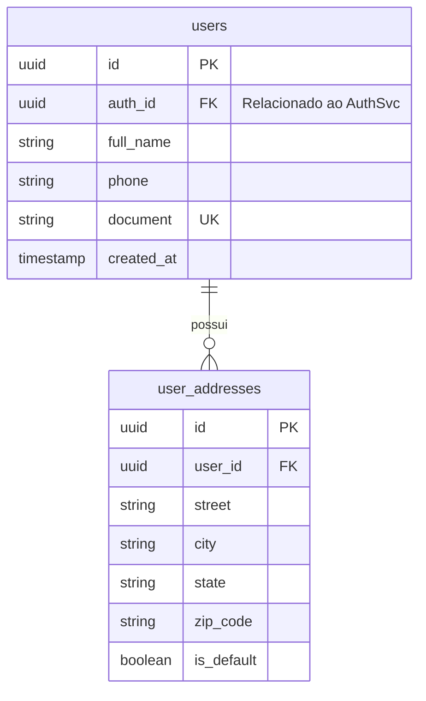

# User Service

> **Documentação de Arquitetura e Engenharia**  
> **Status:** Draft | **Versão:** 1.0.0

## 1. Visão Geral

O **User Service** é um microsserviço síncrono escrito em **Golang 1.23+** focado exclusivamente na gestão de dados não-sensíveis (do ponto de vista de autenticação) e informações de perfil dos usuários. 

Comunicando-se pela porta gRPC `:50052`, o serviço é requisitado pelo BFF para popular telas de perfil do usuário e atende a requisições de outros microsserviços que precisem enriquecer payloads (por exemplo, o `orders-service` buscando o nome do comprador).

### Responsabilidades:
1. CRUD de perfil do usuário (Nome, Telefone, Documento).
2. Gerenciamento de múltiplos endereços por usuário.
3. Resolução rápida de batch de usuários via RPCs eficientes.

---

## 2. Protobuf Definition (`user.proto`)

```protobuf
syntax = "proto3";

package user;
option go_package = "observability-lab/user-service/proto";

service UserService {
  rpc GetUserProfile (GetUserRequest) returns (UserProfileResponse);
  rpc UpdateUserProfile (UpdateUserRequest) returns (UserProfileResponse);
  rpc BatchGetUsers (BatchUserRequest) returns (BatchUserResponse);
}

message GetUserRequest {
  string user_id = 1; // Mapeado do Token JWT pelo BFF
}

message UserProfileResponse {
  string id = 1;
  string full_name = 2;
  string phone = 3;
  string document = 4;
}

message BatchUserRequest {
  repeated string user_ids = 1;
}

message BatchUserResponse {
  map<string, UserProfileResponse> users = 1;
}
```

---

## 3. Arquitetura Interna em Go

O design preza por concorrência e simplicidade.

```mermaid
flowchart TD
    Client[gRPC Clients] --> Handler[gRPC Service Handler]
    Handler --> Logic[User Usecase]
    Logic --> Repo[PostgreSQL Repository]
    Repo --> DB[(PostgreSQL)]
    
    subgraph OTel SDK
       Tracing
       Metrics
    end
    
    Handler -.-> OTel SDK
```

* Métodos como `BatchGetUsers` utilizam goroutines concorrentes de forma controlada ou queries `IN (...)` otimizadas no banco de dados para buscar dezenas de perfis em milissegundos.

---

## 4. Modelo de Dados

Tabelas geridas por este microsserviço dentro do mesmo cluster PostgreSQL (separação lógica ou schema dedicado).



---

## 5. Estrutura de Diretórios Go

```text
user-service/
├── cmd/
│   └── server/
│       └── main.go
├── internal/
│   ├── config/
│   ├── handler/
│   │   └── grpc/
│   ├── usecase/
│   ├── repository/
│   │   ├── postgres/
│   │   └── queries.sql
│   └── telemetry/
├── proto/
│   └── user.proto
├── Dockerfile
├── go.mod
└── go.sum
```

---

## 6. Variáveis de Ambiente

```env
APP_ENV=production
GRPC_PORT=50052

DB_HOST=postgres
DB_PORT=5432
DB_USER=admin
DB_PASSWORD=secret
DB_NAME=ticket_db
DB_SSLMODE=disable

OTEL_EXPORTER_OTLP_ENDPOINT=http://alloy:4317
OTEL_SERVICE_NAME=user-service
```

---

## 7. Dockerfile e Observabilidade OTel

O Dockerfile segue o mesmo modelo *Multi-stage* ultraleve do `auth-service` utilizando Alpine.

**Observabilidade:**
* **gRPC Interceptors:** Todo call gera um Span no Tempo.
* **SQL Tracing:** O driver do banco (`pgx`) é envolvido por bibliotecas otel (ex: `otelsql`) criando spans para queries SQL, permitindo visualizar queries lentas no Grafana.
* **Slog JSON Logs:** Logs atrelados ao Context para exibir trace/span IDs lado a lado com os logs de banco.

---

## 8. Checklist de Produção

- [ ] Índices cobrindo `auth_id` e `document` no PostgreSQL.
- [ ] Configuração de Timeout em todas as chamadas externas.
- [ ] Limitação de tamanho em arrays na RPC `BatchGetUsers` (ex: máx 100 IDs por request) para evitar esgotamento de memória.
- [ ] Implementação de Deadlines e cancelamentos repassados corretamente do context gRPC para as queries SQL.
