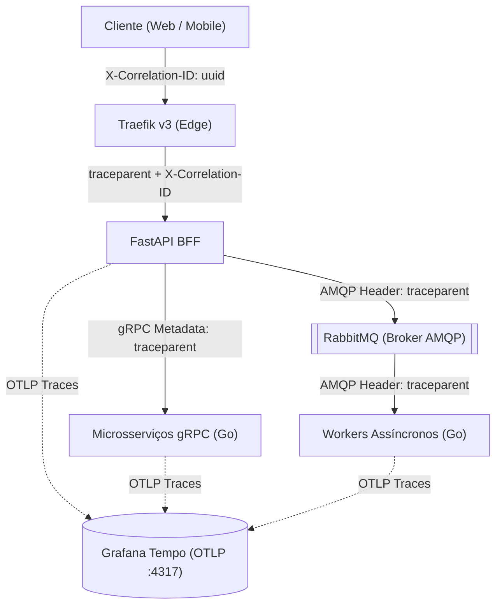

# Padrão de Tracing Distribuído e Propagação de Contexto

> **Versão:** 2.0  
> **Objetivo:** Estabelecer a especificação de rastreamento distribuído (Distributed Tracing), contexto W3C e Correlation ID através de todas as camadas do **Ticket Booking System** (HTTP, gRPC, RabbitMQ e Banco de Dados).

---

# 1. Visão Geral

O ecossistema utiliza o padrão **W3C Trace Context** integrado ao **OpenTelemetry SDK** em todas as aplicações, com o **Grafana Tempo** como backend de armazenamento e consulta TraceQL.

Para facilitar o rastreamento em suporte e auditoria de negócios, o sistema adota também o padrão **Correlation ID** (`X-Correlation-ID`).



---

# 2. Trace ID vs. Correlation ID

| Conceito | Propósito | Formato | Camada de Injeção |
|---|---|---|---|
| **Trace ID** | Identificar uma árvore de spans distribuídos na infraestrutura de observabilidade | Hexadecimal de 32 caracteres (W3C) | Headers de transporte (`traceparent`, gRPC metadata, AMQP headers) |
| **Correlation ID** | Identificar a transação de negócio de ponta a ponta para usuários e suporte | UUID v4 (ex: `550e8400-e29b-...`) | Headers HTTP (`X-Correlation-ID`), Respostas HTTP, Logs estruturados |

---

# 3. Propagação de Contexto por Protocolo

## 3.1 HTTP (FastAPI BFF & Traefik)
- **Headers Recebidos:** `traceparent`, `X-Correlation-ID`.
- Se `X-Correlation-ID` não existir na entrada, o BFF gera um novo `uuid.uuid4()`.
- O OTel SDK extrai o `traceparent` e inicia o root span ou child span.
- O header `X-Correlation-ID` é retornado em todas as respostas HTTP para o cliente.

## 3.2 gRPC (Comunicação Síncrona Go)
- **Injeção (Python Client):**
  ```python
  from opentelemetry.propagate import inject
  metadata = [("x-correlation-id", correlation_id)]
  inject(metadata) # Injeta traceparent nos metadados gRPC
  ```
- **Extração (Go Server Interceptor):**
  ```go
  // Interceptor gRPC extrai traceparent do metadata do contexto
  propagator := otel.GetTextMapPropagator()
  ctx = propagator.Extract(ctx, &MetadataCarrier{MD: md})
  ```

## 3.3 RabbitMQ / AMQP (Comunicação Assíncrona Go/Python)
- **Injeção de Headers no Publisher:**
  ```python
  headers = {
      "X-Correlation-ID": correlation_id,
      "traceparent": current_traceparent,
  }
  await channel.default_exchange.publish(
      Message(body=payload, headers=headers),
      routing_key="order.created"
  )
  ```
- **Extração de Headers no Consumer (Go):**
  ```go
  // Consumer Go extrai traceparent do headers map AMQP
  carrier := AMQPHeaderCarrier(delivery.Headers)
  ctx := otel.GetTextMapPropagator().Extract(context.Background(), carrier)
  tr := otel.Tracer("orders-service")
  ctx, span := tr.Start(ctx, "orders.process_order")
  defer span.End()
  ```

---

# 4. Spans e Nomenclatura Padrão

Todo span gerado deve seguir as convenções de atributos e nomes semânticos do OpenTelemetry:

| Operação | Nome do Span | Atributos Semânticos |
|---|---|---|
| Requisição HTTP | `HTTP GET /api/v1/events` | `http.method`, `http.status_code`, `http.route` |
| Chamada gRPC | `grpc.auth.v1.AuthService/Login` | `rpc.system=grpc`, `rpc.service`, `rpc.method` |
| Publicação AMQP | `publish orders.exchange order.created` | `messaging.system=rabbitmq`, `messaging.destination=orders.exchange` |
| Consumo AMQP | `consume order.created` | `messaging.system=rabbitmq`, `messaging.operation=receive` |
| Transação SQL | `db.postgres.query seats_for_update` | `db.system=postgresql`, `db.statement` (sanitizado) |

---

# 5. Correlação Cruzada no Grafana (Log ↔ Trace ↔ Metric)

A integração completa no Grafana permite navegar bidirecionalmente:

1. **Log no Loki → Trace no Tempo:**
   - O campo `trace_id` no JSON do log é configurado como *Derived Field* com link para `${__data.fields.trace_id}` no Tempo.
2. **Trace no Tempo → Logs no Loki:**
   - Tempo configurado com `trace-to-logs` buscando logs com `{service.name=~"$service"} |= "$trace_id"`.
3. **Trace no Tempo → Métricas no Mimir:**
   - O *Metrics Generator* do Tempo exporta métricas de latência e contagem (RED) diretamente para o Mimir via `remote_write`.
