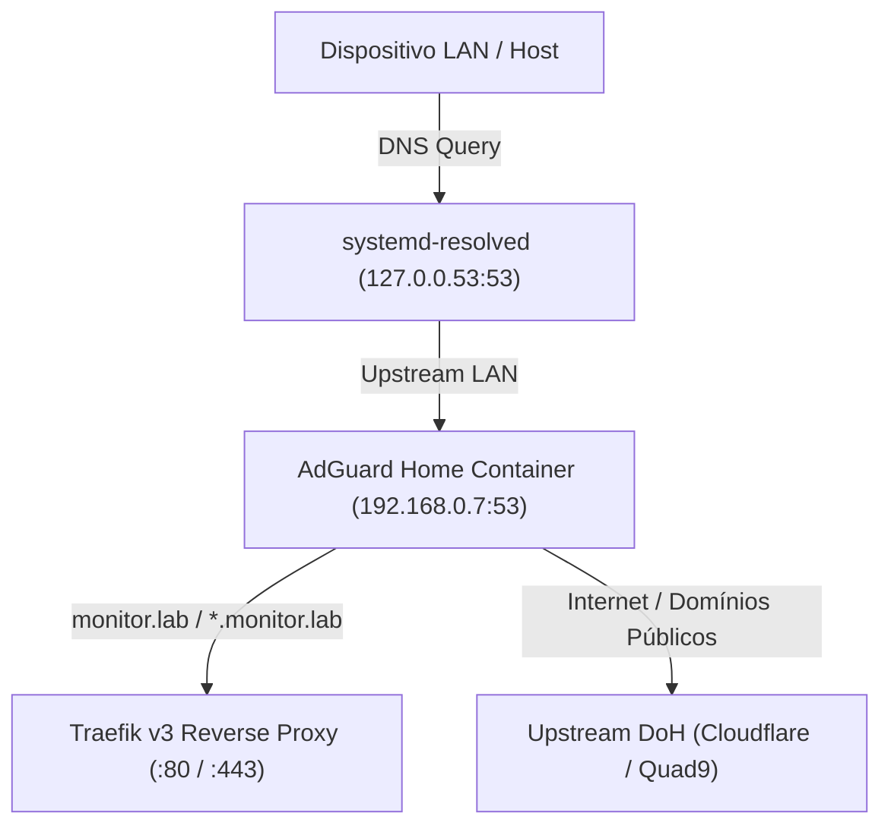

# Padrão de DNS Local e Resolução de Nomes

> **Versão:** 2.0  
> **Objetivo:** Definir o padrão arquitetural, resolução de nomes de domínio (`monitor.lab`), segurança e configuração do servidor DNS local (**AdGuard Home**) integrado ao **Traefik v3**.

---

# 1. Visão Geral

O ecossistema **Observability Lab** utiliza o domínio privado **`monitor.lab`** e seus subdomínios para acessar interfaces web, gateways e dashboards sem necessidade de expor IPs externos ou lembrar números de portas.

O **AdGuard Home** atua como servidor DNS central na rede local (LAN), interceptando consultas locais e encaminhando consultas públicas para servidores DNS criptografados (DNS-over-HTTPS).



---

# 2. Mapeamento de Domínios e Endpoints

Todas as requisições web trafegam através do **Traefik** na porta `443` (HTTPS com certificado local de autoridade certificadora `mkcert`):

| Domínio / Caminho | Serviço | Porta Interna | Descrição |
|---|---|---|---|
| `https://monitor.lab/grafana` | Grafana | 3000 | Dashboards unificados, métricas, logs e traces |
| `https://monitor.lab/mimir` | Grafana Mimir | 8080 | Engine de métricas TSDB e API PromQL |
| `https://monitor.lab/loki` | Grafana Loki | 3100 | Ingestão e consulta LogQL de logs |
| `https://monitor.lab/tempo` | Grafana Tempo | 3200 | Backend de traces distribuídos TraceQL |
| `https://dns.monitor.lab` | AdGuard Home | 3000 | Painel de controle e auditoria DNS |
| `http://monitor.lab:8080/dashboard/` | Traefik | 8080 | Dashboard e status dos routers/serviços |
| `https://monitor.lab/api/v1/*` | FastAPI BFF | 8000 | API Gateway pública do Ticket Booking System |

---

# 3. Coexistência com `systemd-resolved`

Para evitar conflito de porta (`address already in use` na porta 53):

- **`systemd-resolved` (Host):** Vinculado exclusivamente ao loopback `127.0.0.53:53`.
- **`AdGuard Home` (Docker):** Vinculado ao IP da placa de rede física `${HOST_IP:-192.168.0.7}:53`.

### Configuração do Host (`/etc/systemd/resolved.conf.d/adguard.conf`):
```ini
[Resolve]
DNS=192.168.0.7
FallbackDNS=1.1.1.1 9.9.9.9
Domains=monitor.lab
```

---

# 4. Instalação do Certificado Raiz (Root CA)

Para evitar avisos de segurança no navegador ao acessar domínios HTTPS (`https://*.monitor.lab`), instale a CA gerada pelo `mkcert`:

- **Arquivo:** `traefik/certificates/rootCA.pem`
- **Linux:** `sudo cp traefik/certificates/rootCA.pem /usr/local/share/ca-certificates/ && sudo update-ca-certificates`
- **Windows / macOS / Android / iOS:** Importar como "Autoridade de Certificação Confiável".
