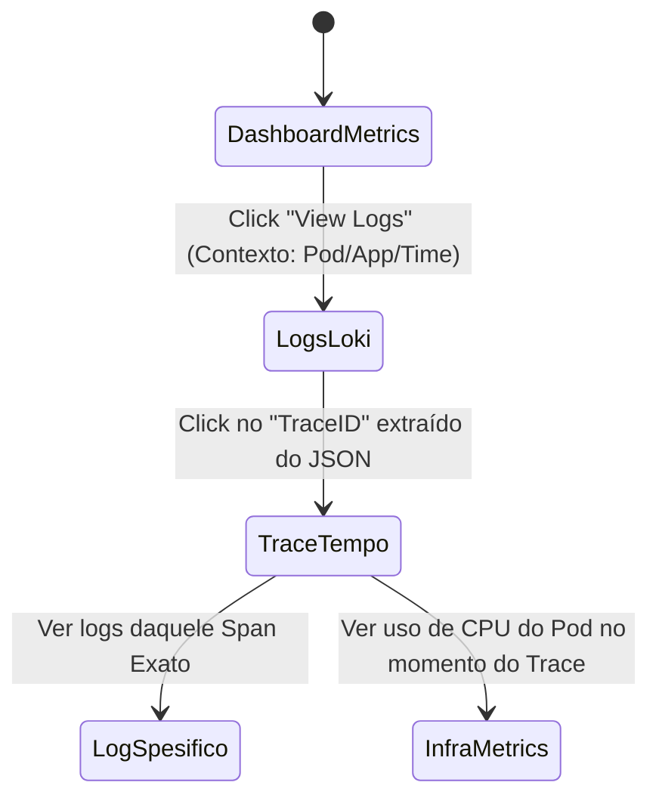

# Padrão de Observabilidade

## 1. Visão Geral

A observabilidade é um dos pilares fundamentais da nossa arquitetura de microsserviços no **Monitor Lab**. Mais do que apenas monitoramento, a observabilidade nos permite entender o estado interno de nossos sistemas a partir de suas saídas externas. 

Nossa estratégia baseia-se nos **Três Pilares da Observabilidade**:

1.  **Metrics (Métricas):** Dados quantitativos que nos informam *quando* um problema ocorre. Permitem entender a saúde, a performance e a utilização de recursos através de agregações matemáticas (ex: taxa de erros, p99 de latência).
2.  **Logs:** Registros textuais e imutáveis de eventos discretos que aconteceram no sistema. Com **Structured Logging** (JSON), nos dizem *o que* ocorreu em detalhes granulares.
3.  **Traces:** Representação do ciclo de vida completo de uma requisição conforme ela atravessa múltiplos microsserviços. Os traces nos informam *onde* o problema está ocorrendo.

A adoção efetiva destes três pilares reduz o *Mean Time to Resolution* (MTTR) e facilita o entendimento do comportamento do sistema em ambientes distribuídos.

---

## 2. Arquitetura da Observabilidade

Nossa arquitetura centraliza a coleta, armazenamento e visualização da telemetria, garantindo que as aplicações permaneçam leves, utilizando o padrão **OpenTelemetry (OTLP)**.

```mermaid
flowchart TD
    %% Clientes
    Client([Client / Browser])
    
    %% API Gateway
    subgraph Edge
        Traefik[Traefik Proxy]
    end
    
    %% Aplicações
    subgraph Apps[Microsserviços]
        App1[users-api\nFastAPI + OTel SDK]
        App2[orders-api\nFastAPI + OTel SDK]
    end
    
    %% Data Stores
    subgraph DataStores[Infraestrutura de Dados]
        PG[(PostgreSQL)]
        Redis[(Redis)]
    end
    
    %% Observabilidade Backends
    subgraph Observability[Grafana Stack]
        Mimir[(Grafana Mimir\nMetrics)]
        Loki[(Grafana Loki\nLogs)]
        Tempo[(Grafana Tempo\nTraces)]
        Grafana[Grafana\nDashboards]
    end
    
    %% Telemetry Collector
    Alloy[Grafana Alloy\n(Telemetry Collector)]
    
    %% Fluxos de Requisição
    Client -->|HTTP/HTTPS| Traefik
    Traefik -->|Roteamento| App1
    Traefik -->|Roteamento| App2
    App1 -.->|Queries| PG
    App2 -.->|Cache/PubSub| Redis
    
    %% Fluxos OTLP Aplicações
    App1 -.->|OTLP Metrics| Mimir
    App1 -.->|OTLP Logs| Loki
    App1 -.->|OTLP Traces| Tempo
    
    App2 -.->|OTLP Metrics| Mimir
    App2 -.->|OTLP Logs| Loki
    App2 -.->|OTLP Traces| Tempo
    
    %% Fluxos Grafana Alloy
    Traefik -.->|Container Logs| Alloy
    PG -.->|Infra Metrics| Alloy
    Redis -.->|Infra Metrics| Alloy
    
    Alloy -.->|Logs| Loki
    Alloy -.->|Metrics| Mimir
    
    %% Visualização
    Mimir <===|PromQL| Grafana
    Loki <===|LogQL| Grafana
    Tempo <===|TraceQL| Grafana
```

---

## 3. OpenTelemetry SDK

Todas as aplicações em Python (FastAPI) **DEVEM** ser instrumentadas utilizando o OpenTelemetry SDK oficial.

### 3.1. Resource Attributes

Cada serviço deve se identificar unicamente no ecossistema através de atributos de recurso. Os seguintes atributos são obrigatórios:

- `service.name`: O nome do serviço (ex: `users-api`).
- `service.version`: A versão atual do deploy (ex: `v1.2.0` ou hash do commit).
- `deployment.environment`: O ambiente (ex: `production`, `staging`, `lab`).

Exemplo de configuração inicial:

```python
from opentelemetry import trace
from opentelemetry.sdk.resources import Resource, SERVICE_NAME, SERVICE_VERSION
from opentelemetry.sdk.trace import TracerProvider
from opentelemetry.sdk.trace.export import BatchSpanProcessor
from opentelemetry.exporter.otlp.proto.grpc.trace_exporter import OTLPSpanExporter

resource = Resource.create({
    SERVICE_NAME: "users-api",
    "service.version": "1.0.0",
    "deployment.environment": "lab"
})

provider = TracerProvider(resource=resource)
processor = BatchSpanProcessor(OTLPSpanExporter(endpoint="http://tempo:4317"))
provider.add_span_processor(processor)
trace.set_tracer_provider(provider)
```

### 3.2. Provedores (Providers)

Devemos configurar:
- **TracerProvider**: Para gerenciar o ciclo de vida dos Spans.
- **MeterProvider**: Para registrar as métricas.
- **LoggerProvider**: Para garantir que os logs da aplicação saiam com Trace ID e Span ID.

### 3.3. Auto-instrumentation

O uso das bibliotecas oficiais de auto-instrumentação é fortemente recomendado para cobrir:
- `FastAPIInstrumentor`
- `SQLAlchemyInstrumentor`
- `HTTPXClientInstrumentor`
- `RedisInstrumentor`

```python
from opentelemetry.instrumentation.fastapi import FastAPIInstrumentor
from opentelemetry.instrumentation.sqlalchemy import SQLAlchemyInstrumentor
from fastapi import FastAPI

app = FastAPI()
FastAPIInstrumentor.instrument_app(app)

# Após criar sua engine SQLAlchemy:
# SQLAlchemyInstrumentor().instrument(engine=engine)
```

### 3.4. Manual Instrumentation

Quando houver uma lógica de negócio complexa, crie Spans manuais para detalhar o processamento:

```python
from opentelemetry import trace

tracer = trace.get_tracer(__name__)

def process_order(order_id: str):
    with tracer.start_as_current_span("process_order") as span:
        span.set_attribute("order.id", order_id)
        try:
            # Lógica complexa
            span.add_event("Validação concluída")
            # ...
        except Exception as e:
            span.record_exception(e)
            span.set_status(trace.status.Status(trace.status.StatusCode.ERROR))
            raise
```

### 3.5. Exporters (OTLP)

Por padrão, a telemetria será exportada via gRPC para os respectivos backends, evitando intermediários desnecessários no ambiente de laboratório:
- **Metrics**: `http://mimir:8080` (OTLP ingestion ativo no Mimir)
- **Logs**: `http://loki:3100` (via otlploghttp ou otlploggrpc, se habilitado, ou via stdout -> Alloy)
- **Traces**: `http://tempo:4317` (gRPC)

---

## 4. Métricas (Mimir)

### 4.1. Métricas Obrigatórias (Standard)

Todo serviço deve expor um conjunto mínimo de métricas (geradas automaticamente pelo OTel FastAPI Instrumentor):

1. **HTTP Request Count**: Total de requisições.
   - Tags: `http.method`, `http.route`, `http.status_code`
2. **HTTP Request Duration Histogram**: Latência das chamadas (para cálcular p50, p90, p95, p99).
3. **Active Requests Gauge**: Número de conexões simultâneas sendo processadas.
4. **Error Rate**: Derivado do HTTP Request Count onde status >= 500.

### 4.2. Métricas de Negócio (Business Metrics)

Instrumente eventos chave de negócio. Exemplo:

```python
from opentelemetry import metrics

meter = metrics.get_meter("users-api")
users_created_counter = meter.create_counter(
    "users.created.total",
    description="Total de usuários criados com sucesso"
)

def create_user(user_data):
    # Lógica de criação
    users_created_counter.add(1, {"user.type": "premium"})
```

### 4.3. PromQL Examples

- **RPS (Requests Per Second)**:
  ```promql
  sum(rate(http_server_duration_count{service_name="users-api"}[1m])) by (http_route)
  ```
- **P95 Latency**:
  ```promql
  histogram_quantile(0.95, sum(rate(http_server_duration_bucket{service_name="users-api"}[5m])) by (le))
  ```
- **Error Rate (%)**:
  ```promql
  sum(rate(http_server_duration_count{http_status_code=~"5.."}[5m])) / 
  sum(rate(http_server_duration_count[5m])) * 100
  ```

---

## 5. Logs (Loki)

### 5.1. Structured Logging Standard

Os logs **NUNCA** devem ser puramente textuais. Eles devem ser emitidos no formato **JSON**, contendo propriedades estruturadas.

Campos obrigatórios (injetados na configuração base):
- `timestamp`: (ISO 8601)
- `level`: (INFO, ERROR, etc.)
- `service`: `users-api`
- `trace_id`: (injetado via OTel)
- `span_id`: (injetado via OTel)
- `correlation_id`: ID gerado no Edge (Traefik) ou na primeira requisição, repassado.
- `message`: Descrição curta e humana.
- Atributos extras de contexto (ex: `user_id`, `path`, `method`).

Exemplo de log ideal:
```json
{
  "timestamp": "2026-08-09T14:30:00Z",
  "level": "INFO",
  "service": "orders-api",
  "trace_id": "5b8e...f211",
  "span_id": "a4b2...1c9",
  "correlation_id": "req-9876",
  "message": "Order created successfully",
  "order_id": "ord-123",
  "amount": 150.50
}
```

### 5.2. Log Levels Policy

- `DEBUG`: Para detalhes finos. NUNCA ativado em Produção por padrão. Apenas desenvolvimento ou troubleshooting profundo.
- `INFO`: O padrão. Eventos de negócio, inícios/fins de fluxo importantes.
- `WARNING`: Situações anormais que não falharam a requisição, mas requerem atenção (ex: retry acionado).
- `ERROR`: A operação falhou. Uma requisição 500. Exige investigação.
- `CRITICAL`: O sistema está inoperante (ex: banco de dados inacessível). Geralmente deve disparar alertas imediatos.

### 5.3. O que NUNCA logar

- Senhas, Hashes (Bcrypt).
- Tokens de Acesso (JWT), Refresh Tokens.
- Dados sensíveis do usuário (PII - Cartões de crédito, CPF sem mascaramento).

### 5.4. LogQL Examples

- Encontrar erros de um serviço:
  ```logql
  {service="users-api", level="ERROR"} | json
  ```
- Buscar um trace específico:
  ```logql
  {service="orders-api"} | json | trace_id="5b8e...f211"
  ```
- Agregação (Erros por minuto):
  ```logql
  sum by (service) (rate({level="ERROR"} [1m]))
  ```

---

## 6. Traces (Tempo)

### 6.1. W3C Trace Context

Adotamos integralmente o padrão **W3C Trace Context**. Toda requisição HTTP entre serviços DEVE propagar os headers:
- `traceparent`
- `tracestate`

O OpenTelemetry se encarrega disso através do `Propagator` (geralmente configurado por padrão nos instrumentors do HTTPX/Requests).

### 6.2. Nomenclatura de Spans (Span Naming Conventions)

O nome do Span deve identificar claramente a operação de forma genérica, sem incluir IDs dinâmicos.
- **Correto**: `GET /users/{id}`, `SQL SELECT users`, `process_payment`
- **Incorreto**: `GET /users/123`, `Query User 456`

### 6.3. Atributos Standard

Siga os Semantic Conventions do OTel.
- Bancos: `db.system`, `db.statement`, `db.name`
- HTTP: `http.method`, `http.route`, `http.status_code`

### 6.4. TraceQL Examples

- Spans de banco lentos (mais de 500ms):
  ```traceql
  { span.db.system = "postgresql" && duration > 500ms }
  ```
- Requisições que falharam:
  ```traceql
  { span.http.status_code >= 500 }
  ```

---

## 7. Grafana Alloy

Grafana Alloy é o nosso coletor unificado.

### 7.1. Papel na Arquitetura

Mesmo que as aplicações (FastAPI) mandem OTLP direto para os backends, o Alloy atua coletando logs de containers (stdout/stderr) dos componentes de infraestrutura que não tem OTLP nativo (ex: Traefik, PostgreSQL, Redis) e os envia para o Loki. Ele também faz o *scraping* de métricas Prometheus desses serviços e as envia para o Mimir.

### 7.2. Responsabilidades do Alloy
- **Docker Logs**: Coletar via socket do Docker.
- **Node/Infra Metrics**: Scraping de exporter de BDs e do Traefik.
- Pipeline de *Relabeling*: Garantir que as labels de infra combinem com os `service.name` utilizados pelas apps.

---

## 8. Correlação Cruzada no Grafana

A mágica da observabilidade moderna está em cruzar os 3 pilares sem esforço.



### 8.1. Log to Trace

O Loki extrai o campo `trace_id` do JSON. No Grafana (Data Source Loki), configuramos **Derived Fields** usando um Regex (ou JSON parser) que pega o valor do `trace_id` e o transforma num link direto para o Data Source do Tempo.

### 8.2. Trace to Metrics / Logs

No Tempo, configuramos a aba **Service Graph** e **Trace to Logs**. O Grafana automaticamente constrói a query no Loki `{service="${__tags.service.name}"} | json | trace_id="${__trace.traceId}"`.

---

## 9. Alerting

### 9.1. Estratégia de Alertas

Alertas devem ser acionáveis. Não crie alertas para "Uso de CPU alto" se isso não afetar o usuário. Foque em **Symptom-based Alerting**.

### 9.2. Alertas Padrão (Mimir / Prometheus Alertmanager)

1. **High Error Rate**: 
   - Regra: `sum(rate(http_server_duration_count{http_status_code=~"5.."}[5m])) / sum(rate(http_server_duration_count[5m])) > 0.05`
   - Significado: Mais de 5% das requisições nos últimos 5 min falharam.
2. **High Latency (SLA Violation)**:
   - Regra: O p99 da latência é maior que 2 segundos.
3. **Service Down**:
   - Regra: `up{service="users-api"} == 0` por mais de 2 minutos.

### 9.3. Canais

- **Warning**: Slack / Discord channel (ex: `#lab-alerts`).
- **Critical**: Email / PagerDuty.

---

## 10. Dashboards

Todo microsserviço precisa de visibilidade.

### 10.1. RED Metrics Dashboard
O padrão Ouro para serviços Request/Driven:
- **Rate**: Request per second.
- **Errors**: Error rate (% e absoluto).
- **Duration**: P50, P90, P95, P99 em milissegundos.

### 10.2. Infra Dashboard
- Uso de CPU, Memória, I/O do Container (Alloy / cAdvisor).
- Conexões de banco abertas, Pool de conexões do SQLAlchemy.

### 10.3. Business Dashboard
Painel dedicado aos KPIs do negócio, alimentado pelas métricas OTel customizadas e consultas SQL se necessário.

---

## 11. Nomenclatura e Convenções

- **Nomes de Serviço (service.name)**: Sempre `kebab-case`. Sufixo com o tipo. Ex: `users-api`, `orders-worker`.
- **Métricas Customizadas**: Formato `namespace_entidade_açao_tipo`.
  - Ex: `orders_payment_processed_total`
- **Labels (Tags)**: `snake_case`. Ex: `tenant_id`, `payment_method`.
- **Dashboards**: Organizados em Folders no Grafana por "Produto" ou "Domínio".

---

## 12. Checklist de Observabilidade (Por Serviço)

Antes de promover um serviço para produção (ou finalizar a fase no laboratório), valide:

- [ ] Variáveis OTel configuradas (`OTEL_SERVICE_NAME`, `OTEL_EXPORTER_OTLP_ENDPOINT`).
- [ ] OTel FastAPI instrumentor ativado no `main.py`.
- [ ] SQLAlchemy e HTTPX instrumentados.
- [ ] Propagação W3C habilitada (Headers recebidos são repassados).
- [ ] Formato de Log estruturado em JSON com injeção automática de `trace_id` e `span_id`.
- [ ] Log de Health Check (ping) suprimido para não gerar ruído no Loki.
- [ ] Métricas padrão (HTTP Server Duration) aparecendo no Mimir.
- [ ] Dashboards RED criados no Grafana para o serviço.
- [ ] Pelo menos 1 Alerta configurado (Taxa de Erro).
- [ ] Traces conectando chamadas do Traefik -> Serviço -> Banco de Dados visíveis no Tempo.
- [ ] Senhas, tokens e chaves filtradas/mascaradas antes do log.

---
*Este documento é um artefato vivo. Atualize conforme o laboratório evolui e novas ferramentas são introduzidas.*
